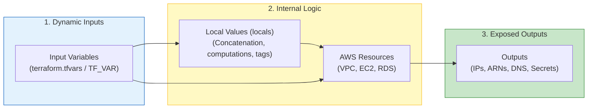
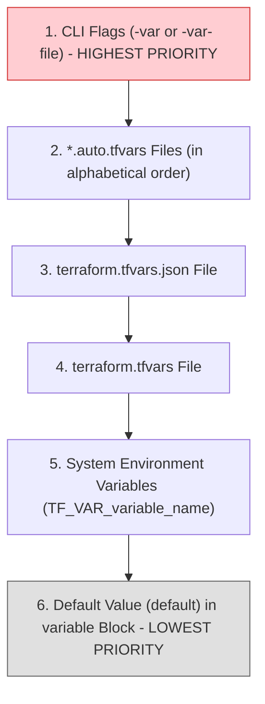

# 04 - Variables, Locals & Outputs

To make infrastructure code reusable, maintainable, and secure, hardcoding values is unthinkable. Terraform offers a strict three-layer data model: **Variables** (incoming data), **Locals** (internal computations), and **Outputs** (exported data).

---

## 1. Data Flow in Terraform



---

## 2. Input Variables (`variable`)

An input variable is the equivalent of a function argument. In production, it should always have a `description`, an explicit `type` and, if needed, a `validation` rule.

### A. Strict Typing & Validation

```hcl
variable "environment" {
  description = "Environnement cible de déploiement"
  type        = string
  default     = "dev"

  # Règle de validation personnalisée (évite les erreurs avant tout appel AWS)
  validation {
    condition     = contains(["dev", "staging", "prod"], var.environment)
    error_message = "L'environnement doit être strictement l'un des suivants : dev, staging, prod."
  }
}

variable "vpc_cidr" {
  description = "Bloc CIDR principal du VPC"
  type        = string
  default     = "10.0.0.0/16"

  validation {
    condition     = can(cidrnetmask(var.vpc_cidr))
    error_message = "La valeur renseignée doit être un bloc CIDR IPv4 valide."
  }
}

variable "database_password" {
  description = "Mot de passe administrateur pour la base RDS"
  type        = string
  sensitive   = true # Masque la valeur dans les logs de sortie console
}
```

!!! danger "The `sensitive = true` Attribute: What It Does and Does NOT Do"
    - **What it does:** It prevents the value from appearing in plain text in the terminal during `terraform plan` and `terraform apply` (shown as `(sensitive value)`).
    - **What it does NOT do:** It **does not encrypt** the value in the `terraform.tfstate` file. The secret remains readable in plain text in the state JSON. Hence the absolute necessity of securing the S3 backend with KMS.

---

### B. Variable Precedence Order

This is one of the most common tricky questions in DevOps interviews. If the same variable is defined in multiple places, which value wins?



1. **`-var` or `-var-file`** on the command line: Overrides everything else.
2. **`*.auto.tfvars`**: Automatically loaded in alphabetical order.
3. **`terraform.tfvars`**: The standard file for project values.
4. **`TF_VAR_<name>`**: Environment variables exported in the shell (ideal for passing secrets in CI/CD without a file on disk: `export TF_VAR_database_password="secret"`).
5. **`default`**: Used only if no other source provided a value.

---

## 3. Local Values (`locals`)

Unlike variables that come from outside, **locals** are internal constants or computations within the module. They cannot be overridden by the code consumer.

### When to Use `locals`?
* To apply the company's naming convention (e.g., `project-environment-resource`).
* To factor a common tag dictionary reused across 50 AWS resources.
* To avoid repeating complex logical expressions.

```hcl
locals {
  name_prefix = "${var.project}-${var.environment}"

  # Tags de gouvernance standardisés injectés partout
  common_tags = {
    Project     = var.project
    Environment = var.environment
    ManagedBy   = "Terraform"
    Owner       = "Equipe-Platform"
    CreatedDate = "2026-09-23"
  }

  # Calcul dynamique de sous-réseaux
  azs = ["eu-west-3a", "eu-west-3b"]
}

# Utilisation dans une ressource AWS
resource "aws_vpc" "main" {
  cidr_block = var.vpc_cidr

  tags = merge(local.common_tags, {
    Name = "${local.name_prefix}-vpc"
  })
}
```

---

## 4. Outputs (`outputs`)

**Outputs** serve three critical purposes:

1. **Display useful information** at the end of deployment (e.g., the public URL of the Application Load Balancer or the EKS cluster ID).
2. **Expose data from a Child Module** to the Root Module.
3. **Share data between separate projects** via `data "terraform_remote_state"`.

```hcl
output "vpc_id" {
  description = "Identifiant unique du VPC créé"
  value       = aws_vpc.main.id
}

output "database_endpoint" {
  description = "Point de terminaison DNS pour la base de données"
  value       = aws_db_instance.postgres.endpoint
}

output "master_password" {
  description = "Mot de passe maître généré"
  value       = aws_db_instance.postgres.password
  sensitive   = true # Empêche l'affichage dans la console lors de terraform apply
}
```

To extract an output in a bash script or CI/CD pipeline:
```bash
# Affiche la valeur brute sans guillemets
terraform output -raw database_endpoint

# Affiche l'ensemble des outputs au format JSON
terraform output -json
```

---

## 5. Frequently Asked Interview Questions (Entry-Level)

!!! question "Q: What is the fundamental difference between a `variable` and a `local`?"
    A `variable` (Input Variable) is a parameter configurable from the outside by the module consumer or injected by CI/CD via `.tfvars` files or `TF_VAR_` environment variables. A `local` (Local Value) is a closed internal variable, computed within the HCL code itself, that cannot be modified by an external user. `locals` are used to centralize naming logic, combine strings, or avoid duplicating infrastructure tags.

!!! question "Q: If a variable is defined in `terraform.tfvars` AND via a `TF_VAR_` environment variable, which value will Terraform use?"
    The value in the `terraform.tfvars` file will be used. In Terraform's precedence order, `terraform.tfvars` files have higher priority than `TF_VAR_` system environment variables. To override the `terraform.tfvars` value, you would need to use the CLI argument `-var` or a `*.auto.tfvars` file.

!!! question "Q: What is the purpose of `sensitive = true` on a variable or output?"
    It tells Terraform to hide the value in standard terminal output and execution logs during `plan`, `apply`, and `output` commands. This is essential to protect secrets (passwords, API keys, tokens). Note: it does not prevent the value from being stored in plain text in the `terraform.tfstate` file.

!!! question "Q: How do you validate a variable's format before Terraform even starts the plan?"
    Add a `validation` block inside the variable definition. This block includes a boolean `condition` (often combined with functions like `can()`, `regex()` or `contains()`) and an `error_message`. If the condition returns false, Terraform immediately stops execution with the specified error message, without making unnecessary AWS API calls.
