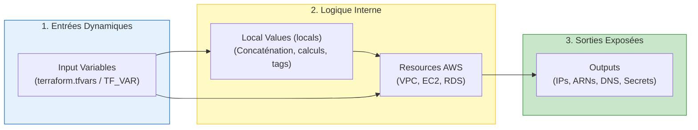
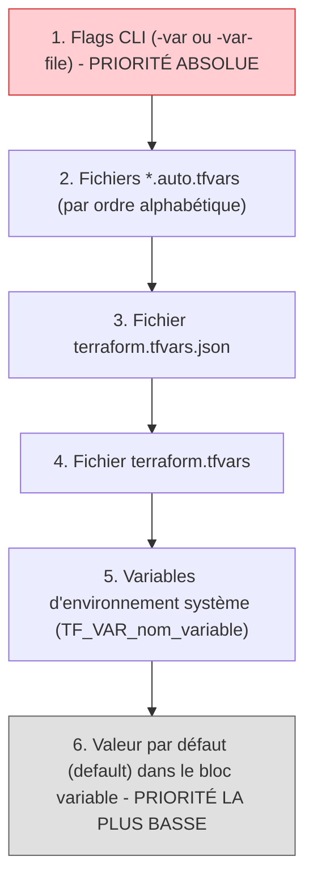

# 04 - Variables, Locals & Outputs

Pour rendre le code d'infrastructure réutilisable, maintenable et sécurisé, il est impensable de coder des valeurs en dur (hardcoding). Terraform propose un modèle de données strict en trois couches : les **Variables** (données entrantes), les **Locals** (calculs internes) et les **Outputs** (données exportées).

---

## 1. Le Flux de Données dans Terraform



---

## 2. Les Variables d'Entrée (`variable`)

Une variable d'entrée est l'équivalent d'un argument de fonction. En production, elle doit toujours avoir une `description`, un `type` explicite et, si nécessaire, une règle de `validation`.

### A. Typage Strict & Validation

```hcl
variable "environment" {
  description = "Environnement cible de déploiement"
  type        = string
  default     = "dev"

  # Règle de validation personnalisée (évite les erreurs avant tout appel AWS)
  validation {
    condition     = contains(["dev", "staging", "prod"], var.environment)
    error_message = "L'environnement doit être strictement l'un des suivants : dev, staging, prod."
  }
}

variable "vpc_cidr" {
  description = "Bloc CIDR principal du VPC"
  type        = string
  default     = "10.0.0.0/16"

  validation {
    condition     = can(cidrnetmask(var.vpc_cidr))
    error_message = "La valeur renseignée doit être un bloc CIDR IPv4 valide."
  }
}

variable "database_password" {
  description = "Mot de passe administrateur pour la base RDS"
  type        = string
  sensitive   = true # Masque la valeur dans les logs de sortie console
}
```

!!! danger "L'Attribut `sensitive = true` : Ce qu'il fait et ce qu'il NE fait PAS"
    - **Ce qu'il fait :** Il empêche la valeur d'apparaître en clair dans le terminal lors des `terraform plan` et `terraform apply` (affiché sous la forme `(sensitive value)`).
    - **Ce qu'il NE fait PAS :** Il **ne chiffre pas** la valeur dans le fichier `terraform.tfstate`. Le secret reste lisible en clair dans le JSON d'état. D'où l'importance absolue de sécuriser le backend S3 avec KMS.

---

### B. L'Ordre de Priorité des Variables (Précédence)

C'est l'une des questions pièges les plus posées en entretien DevOps. Si la même variable est définie à plusieurs endroits, quelle valeur gagne ?



1. **`-var` ou `-var-file`** en ligne de commande : Écrase tout le reste.
2. **`*.auto.tfvars`** : Chargés automatiquement par ordre alphabétique.
3. **`terraform.tfvars`** : Le fichier standard pour les valeurs d'un projet.
4. **`TF_VAR_<nom>`** : Variables d'environnement exportées dans le shell (idéal pour passer des secrets en CI/CD sans fichier sur disque : `export TF_VAR_database_password="secret"`).
5. **`default`** : Utilisé uniquement si aucune autre source n'a fourni de valeur.

---

## 3. Les Valeurs Locales (`locals`)

Contrairement aux variables qui viennent de l'extérieur, les **locals** sont des constantes ou des calculs internes au module. Elles ne peuvent pas être surchargées par l'utilisateur du code.

### Quand utiliser `locals` ?
* Pour appliquer la convention de nommage de l'entreprise (ex: `projet-environnement-ressource`).
* Pour factoriser un dictionnaire de tags communs réutilisés sur 50 ressources AWS.
* Pour éviter de répéter des expressions logiques complexes.

```hcl
locals {
  name_prefix = "${var.project}-${var.environment}"

  # Tags de gouvernance standardisés injectés partout
  common_tags = {
    Project     = var.project
    Environment = var.environment
    ManagedBy   = "Terraform"
    Owner       = "Equipe-Platform"
    CreatedDate = "2026-09-23"
  }

  # Calcul dynamique de sous-réseaux
  azs = ["eu-west-3a", "eu-west-3b"]
}

# Utilisation dans une ressource AWS
resource "aws_vpc" "main" {
  cidr_block = var.vpc_cidr

  tags = merge(local.common_tags, {
    Name = "${local.name_prefix}-vpc"
  })
}
```

---

## 4. Les Sorties (`outputs`)

Les **Outputs** remplissent trois missions critiques :

1. **Afficher des informations utiles** à la fin du déploiement (ex: l'URL publique de l'Application Load Balancer ou l'ID du cluster EKS).
2. **Exposer des données d'un Child Module** vers le Root Module.
3. **Partager des données entre projets distincts** via `data "terraform_remote_state"`.

```hcl
output "vpc_id" {
  description = "Identifiant unique du VPC créé"
  value       = aws_vpc.main.id
}

output "database_endpoint" {
  description = "Point de terminaison DNS pour la base de données"
  value       = aws_db_instance.postgres.endpoint
}

output "master_password" {
  description = "Mot de passe maître généré"
  value       = aws_db_instance.postgres.password
  sensitive   = true # Empêche l'affichage dans la console lors de terraform apply
}
```

Pour extraire une sortie dans un script bash ou un pipeline CI/CD :
```bash
# Affiche la valeur brute sans guillemets
terraform output -raw database_endpoint

# Affiche l'ensemble des outputs au format JSON
terraform output -json
```

---

## 5. Questions d'Entretien Fréquentes (Niveau Entry-Level)

!!! question "Q: Quelle est la différence fondamentale entre une `variable` et un `local` ?"
    Une `variable` (Input Variable) est un paramètre configurable de l'extérieur par l'utilisateur du module ou injecté par la CI/CD via des fichiers `.tfvars` ou des variables d'environnement `TF_VAR_`. Un `local` (Local Value) est une variable interne fermée, calculée au sein même du code HCL, qui ne peut pas être modifiée par un utilisateur externe. On utilise les `locals` pour centraliser la logique de nommage, combiner des chaînes ou éviter la duplication de tags d'infrastructure.

!!! question "Q: Si une variable est définie dans `terraform.tfvars` ET via une variable d'environnement `TF_VAR_`, quelle valeur prendra Terraform ?"
    C'est la valeur présente dans le fichier `terraform.tfvars` qui sera prise en compte. Dans l'ordre de précédence de Terraform, les fichiers `terraform.tfvars` ont une priorité plus élevée que les variables d'environnement système `TF_VAR_`. Pour écraser la valeur de `terraform.tfvars`, il faudrait utiliser l'argument CLI `-var` ou un fichier `*.auto.tfvars`.

!!! question "Q: À quoi sert le paramètre `sensitive = true` sur une variable ou un output ?"
    Il demande à Terraform de masquer la valeur dans les sorties standard du terminal et dans les logs d'exécution lors des commandes `plan`, `apply` et `output`. C'est indispensable pour protéger les secrets (mots de passe, clés d'API, tokens). Attention : cela n'empêche pas la valeur d'être stockée en clair dans le fichier `terraform.tfstate`.

!!! question "Q: Comment valider le format d'une variable avant même que Terraform ne lance le plan ?"
    On intègre un bloc `validation` à l'intérieur de la définition de la variable. Ce bloc comprend une `condition` booléenne (souvent combinée avec des fonctions comme `can()`, `regex()` ou `contains()`) et un `error_message`. Si la condition retourne faux, Terraform interrompt l'exécution immédiatement avec le message d'erreur spécifié, sans faire d'appel inutile aux API AWS.