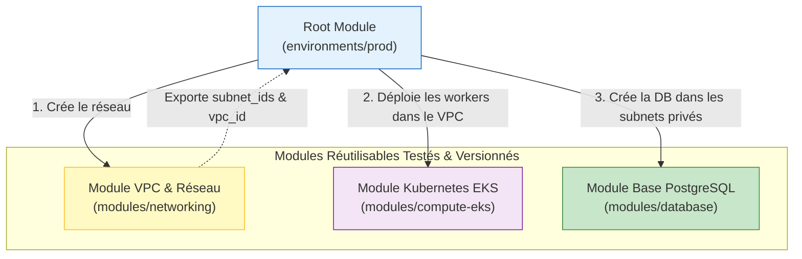

# 05 - Creating and Using Modules

In an organization with dozens or hundreds of engineers, copy-pasting AWS configuration blocks from one project to another is the primary cause of security flaws and inconsistencies. Terraform **Modules** are the fundamental mechanism for abstraction, standardization, and code reusability.

---

## 1. Module Architecture & Philosophy

A Terraform module is simply a directory containing `.tf` files.

* **Root Module:** The directory from which you run `terraform init` and `terraform apply`.
* **Child Module:** A module called from another module via a `module` block.



### Canonical Anatomy of a Standard Module

In an enterprise, a standalone module strictly follows this layout:

```text
modules/aws-secure-bucket/
├── main.tf         # Déclaration des ressources AWS réelles
├── variables.tf    # Paramètres d'entrée requis et optionnels
├── outputs.tf      # Données exportées (IDs, ARNs, DNS)
├── versions.tf     # Versions minimales de Terraform et du Provider AWS
└── README.md       # Documentation d'usage (souvent générée par terraform-docs)
```

---

## 2. Hands-On: Creating a Reusable AWS Module

Let's create a module to ensure no developer in the company can create an S3 bucket without encryption, versioning, and public access blocking.

### A. Child Module Code (`modules/aws-secure-bucket/`)

**`modules/aws-secure-bucket/variables.tf`**
```hcl
variable "bucket_name" {
  description = "Nom unique du bucket S3"
  type        = string
}

variable "enable_versioning" {
  description = "Activer le versioning des objets"
  type        = bool
  default     = true
}

variable "environment" {
  description = "Environnement (dev, staging, prod)"
  type        = string
}
```

**`modules/aws-secure-bucket/main.tf`**
```hcl
resource "aws_s3_bucket" "this" {
  bucket = var.bucket_name

  tags = {
    Environment = var.environment
    ManagedBy   = "Terraform"
  }
}

resource "aws_s3_bucket_versioning" "this" {
  bucket = aws_s3_bucket.this.id
  versioning_configuration {
    status = var.enable_versioning ? "Enabled" : "Suspended"
  }
}

# Sécurité imposée par le module (non débrayable par l'utilisateur)
resource "aws_s3_bucket_public_access_block" "this" {
  bucket = aws_s3_bucket.this.id

  block_public_acls       = true
  block_public_policy     = true
  ignore_public_acls      = true
  restrict_public_buckets = true
}
```

**`modules/aws-secure-bucket/outputs.tf`**
```hcl
output "bucket_id" {
  description = "Le nom/ID du bucket créé"
  value       = aws_s3_bucket.this.id
}

output "bucket_arn" {
  description = "L'ARN du bucket pour les policies IAM"
  value       = aws_s3_bucket.this.arn
}
```

---

### B. Call from the Root Module (`environments/prod/main.tf`)

```hcl
# Consommation du module local
module "app_storage" {
  source = "../../modules/aws-secure-bucket"

  bucket_name       = "mon-entreprise-prod-assets-2026"
  enable_versioning = true
  environment       = "prod"
}

# Utilisation directe de l'output du module pour une policy IAM
resource "aws_iam_policy" "read_assets" {
  name = "AppReadAssetsPolicy"

  policy = jsonencode({
    Version = "2012-10-17"
    Statement = [{
      Effect   = "Allow"
      Action   = ["s3:GetObject"]
      Resource = "${module.app_storage.bucket_arn}/*"
    }]
  })
}
```

---

## 3. Module Sources & Versioning Strategy

A module can be consumed from several sources:

1. **Local relative path:** `source = "./modules/vpc"` (great for project-specific modules).
2. **Public Terraform Registry:** `source = "terraform-aws-modules/vpc/aws"` (community-maintained AWS modules).
3. **Enterprise Git repository:**
```hcl
module "vpc" {
  # Syntaxe Git avec sélection d'un tag sémantique
  source = "git::https://github.com/mon-org/terraform-aws-vpc.git?ref=v2.4.1"

  vpc_cidr = "10.100.0.0/16"
}
```

!!! danger "Golden Rule in Production: Always Pin Git Versions"
    **NEVER** target the main branch (`?ref=main` or `?ref=master`) for a remote module in production. If a contributor pushes a commit with a breaking change to main, your next `terraform init -upgrade` or CI pipeline will break production infrastructure. Always target an **immutable tag** (`?ref=v1.2.0`).

---

## 4. Advanced Module Features

### A. Multi-Instantiation with `for_each`
Since Terraform 0.13, you can instantiate a module multiple times dynamically with `for_each`:

```hcl
locals {
  services = {
    auth    = "mon-entreprise-auth-data"
    billing = "mon-entreprise-billing-data"
  }
}

module "service_buckets" {
  source   = "../../modules/aws-secure-bucket"
  for_each = local.services

  bucket_name = each.value
  environment = "prod"
}
```

### B. Refactoring without Destruction: The `moved` Block
If you move an existing resource inside a module, you can declare a `moved` block in HCL code. Terraform will update State automatically without destroying the resource:

```hcl
moved {
  from = aws_s3_bucket.app_assets
  to   = module.app_storage.aws_s3_bucket.this
}
```

!!! warning "Interview Anti-Pattern: The 'God Module' (Monolith)"
    Creating a single giant module that deploys the VPC, EKS cluster, RDS database, and Route53 domain in one block is a major anti-pattern:
    
    - Impossible to unit-test.
    - Very rigid and not reusable for other teams.
    - Asymmetric lifecycle: a VPC rarely changes, while an EKS service changes daily.

---

## 5. Frequently Asked Interview Questions (Entry-Level)

!!! question "Q: Why use modules instead of writing all resources in a single project?"
    Modules follow the DRY (Don't Repeat Yourself) principle. They encapsulate infrastructure complexity, enforce strict security and compliance standards (e.g., enforcing S3 encryption), reduce code duplication, and allow teams to consume ready-to-use building blocks without reinventing the architecture.

!!! question "Q: How do you access an attribute of a resource created inside a Child Module?"
    You cannot directly access internal resources of a Child Module from the Root Module. The Child Module must explicitly declare an `output` block exporting the desired value (e.g., `output "vpc_id" { value = aws_vpc.this.id }`). Then the Root Module can access it via `module.<module_name>.<output_name>`.

!!! question "Q: How do you handle version upgrades of a module shared across multiple teams?"
    Use semantic versioning (SemVer) via Git tags on the module repository (e.g., `v1.0.0`, `v1.1.0`, `v2.0.0`). In the consumer code, each team references a specific tag via `source = "...?ref=v1.1.0"`. Thus, publishing a new version (v2.0.0 with a breaking change) impacts no one until a team voluntarily decides to update its tag and test the plan.

!!! question "Q: What is the `moved` block introduced in Terraform 1.1 for?"
    The `moved` block lets you record code refactorings (resource renaming or moving a resource into a module) directly in HCL files. When a colleague or CI pipeline runs `terraform plan`, Terraform reads this block and automatically updates the state tree in State, eliminating the need to manually run `terraform state mv` commands and avoiding accidental destruction of production resources.
