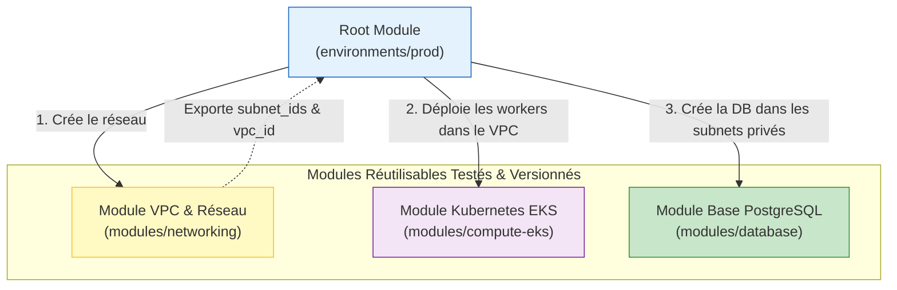

# 05 - Création et utilisation de Modules

Dans une organisation de plusieurs dizaines ou centaines d'ingénieurs, copier-coller des blocs de configuration AWS d'un projet à un autre est la première cause de failles de sécurité et d'incohérences. Les **Modules** Terraform sont le mécanisme fondamental d'abstraction, de standardisation et de réutilisabilité du code d'infrastructure.

---

## 1. Architecture & Philosophie des Modules

Un module Terraform est simplement un répertoire contenant des fichiers `.tf`. 

* **Root Module (Module racine) :** Le dossier d'où vous lancez les commandes `terraform init` et `terraform apply`.
* **Child Module (Module enfant) :** Un module appelé depuis un autre module via un bloc `module`.



### Anatomie Canonique d'un Module Standard

En entreprise, un module autonome respecte scrupuleusement cette arborescence :

```text
modules/aws-secure-bucket/
├── main.tf         # Déclaration des ressources AWS réelles
├── variables.tf    # Paramètres d'entrée requis et optionnels
├── outputs.tf      # Données exportées (IDs, ARNs, DNS)
├── versions.tf     # Versions minimales de Terraform et du Provider AWS
└── README.md       # Documentation d'usage (souvent générée par terraform-docs)
```

---

## 2. Cas Pratique : Création d'un Module Réutilisable AWS

Créons un module pour garantir qu'aucun développeur de l'entreprise ne puisse créer un bucket S3 sans chiffrement, sans versioning et sans blocage public.

### A. Le Code du Child Module (`modules/aws-secure-bucket/`)

**`modules/aws-secure-bucket/variables.tf`**
```hcl
variable "bucket_name" {
  description = "Nom unique du bucket S3"
  type        = string
}

variable "enable_versioning" {
  description = "Activer le versioning des objets"
  type        = bool
  default     = true
}

variable "environment" {
  description = "Environnement (dev, staging, prod)"
  type        = string
}
```

**`modules/aws-secure-bucket/main.tf`**
```hcl
resource "aws_s3_bucket" "this" {
  bucket = var.bucket_name

  tags = {
    Environment = var.environment
    ManagedBy   = "Terraform"
  }
}

resource "aws_s3_bucket_versioning" "this" {
  bucket = aws_s3_bucket.this.id
  versioning_configuration {
    status = var.enable_versioning ? "Enabled" : "Suspended"
  }
}

# Sécurité imposée par le module (non débrayable par l'utilisateur)
resource "aws_s3_bucket_public_access_block" "this" {
  bucket = aws_s3_bucket.this.id

  block_public_acls       = true
  block_public_policy     = true
  ignore_public_acls      = true
  restrict_public_buckets = true
}
```

**`modules/aws-secure-bucket/outputs.tf`**
```hcl
output "bucket_id" {
  description = "Le nom/ID du bucket créé"
  value       = aws_s3_bucket.this.id
}

output "bucket_arn" {
  description = "L'ARN du bucket pour les policies IAM"
  value       = aws_s3_bucket.this.arn
}
```

---

### B. L'Appel depuis le Root Module (`environments/prod/main.tf`)

```hcl
# Consommation du module local
module "app_storage" {
  source = "../../modules/aws-secure-bucket"

  bucket_name       = "mon-entreprise-prod-assets-2026"
  enable_versioning = true
  environment       = "prod"
}

# Utilisation directe de l'output du module pour une policy IAM
resource "aws_iam_policy" "read_assets" {
  name = "AppReadAssetsPolicy"

  policy = jsonencode({
    Version = "2012-10-17"
    Statement = [{
      Effect   = "Allow"
      Action   = ["s3:GetObject"]
      Resource = "${module.app_storage.bucket_arn}/*"
    }]
  })
}
```

---

## 3. Sources de Modules & Stratégie de Versioning

Un module peut être consommé depuis plusieurs sources :

1. **Chemin relatif local :** `source = "./modules/vpc"` (très bien pour les modules spécifiques à un projet).
2. **Terraform Registry Public :** `source = "terraform-aws-modules/vpc/aws"` (modules maintenus par la communauté AWS).
3. **Dépôt Git d'entreprise :**
```hcl
module "vpc" {
  # Syntaxe Git avec sélection d'un tag sémantique
  source = "git::https://github.com/mon-org/terraform-aws-vpc.git?ref=v2.4.1"

  vpc_cidr = "10.100.0.0/16"
}
```

!!! danger "Règle d'or en Production : Figer impérativement les versions Git"
    Ne ciblez **JAMAIS** la branche principale (`?ref=main` ou `?ref=master`) pour un module distant en production. Si un contributeur pousse un commit avec un breaking change sur la branche principale, votre prochain `terraform init -upgrade` ou votre pipeline CI cassera l'infrastructure de production. Ciblez toujours un **tag immuable** (`?ref=v1.2.0`).

---

## 4. Fonctionnalités Avancées des Modules

### A. Multi-instanciation avec `for_each`
Depuis Terraform 0.13, vous pouvez instancier un module plusieurs fois dynamiquement avec `for_each` :

```hcl
locals {
  services = {
    auth    = "mon-entreprise-auth-data"
    billing = "mon-entreprise-billing-data"
  }
}

module "service_buckets" {
  source   = "../../modules/aws-secure-bucket"
  for_each = local.services

  bucket_name = each.value
  environment = "prod"
}
```

### B. Refactoring sans destruction : Le bloc `moved`
Si vous déplacez une ressource existante à l'intérieur d'un module, vous pouvez déclarer un bloc `moved` dans le code HCL. Terraform mettra à jour le State automatiquement sans détruire la ressource :

```hcl
moved {
  from = aws_s3_bucket.app_assets
  to   = module.app_storage.aws_s3_bucket.this
}
```

!!! warning "Anti-pattern d'entretien : Le 'God Module' (Monolithe)"
    Créer un module unique géant qui déploie le VPC, le cluster EKS, la base RDS et le domaine Route53 en un seul bloc est un anti-pattern majeur :
    - Impossible à tester unitairement.
    - Très rigide et non réutilisable pour d'autres équipes.
    - Cycle de vie asymétrique : un VPC change rarement, alors qu'un service EKS change quotidiennement.

---

## 5. Questions d'Entretien Fréquentes (Niveau Entry-Level)

!!! question "Q: Pourquoi utilise-t-on des modules au lieu d'écrire toutes les ressources dans un seul projet ?"
    Les modules répondent au principe DRY (Don't Repeat Yourself). Ils permettent d'encapsuler la complexité de l'infrastructure, d'imposer des standards de sécurité et de conformité stricts (ex: forcer le chiffrement S3), de réduire la duplication de code et de permettre aux équipes de consommer des briques prêtes à l'emploi sans devoir réinventer l'architecture.

!!! question "Q: Comment accédez-vous à l'attribut d'une ressource créée à l'intérieur d'un Child Module ?"
    On ne peut pas accéder directement aux ressources internes d'un Child Module depuis le Root Module. Le Child Module doit explicitement déclarer un bloc `output` exportant la valeur souhaitée (ex: `output "vpc_id" { value = aws_vpc.this.id }`). Ensuite, le Root Module peut y accéder via la syntaxe `module.<nom_du_module>.<nom_de_l_output>`.

!!! question "Q: Comment gérez-vous les montées de version d'un module partagé entre plusieurs équipes ?"
    On utilise le versioning sémantique (SemVer) via des tags Git sur le dépôt du module (ex: `v1.0.0`, `v1.1.0`, `v2.0.0`). Dans le code consommateur, chaque équipe référence un tag précis via le paramètre `source = "...?ref=v1.1.0"`. Ainsi, la publication d'une nouvelle version (v2.0.0 avec breaking change) n'impacte personne tant que l'équipe ne décide pas volontairement de mettre à jour son tag et de tester le plan.

!!! question "Q: À quoi sert le bloc `moved` introduit dans Terraform 1.1 ?"
    Le bloc `moved` permet d'enregistrer les refactorisations de code (renommage de ressources ou déplacement d'une ressource vers un module) directement dans les fichiers HCL. Lorsqu'un collègue ou un pipeline CI exécute `terraform plan`, Terraform lit ce bloc et met à jour l'arbre d'état dans le State automatiquement, éliminant ainsi le besoin d'exécuter manuellement des commandes `terraform state mv` et évitant la destruction accidentelle de ressources en production.