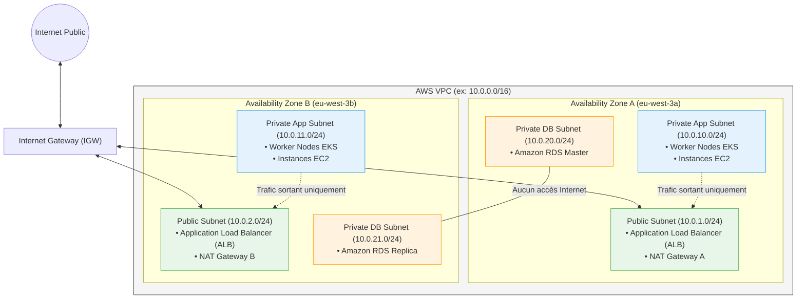

# 06 - AWS Networking (VPC, Subnets, SG, NAT)

No workload (Kubernetes container, EC2 machine, RDS database) can run on AWS without a robust, highly available, and secure network architecture. This chapter details the design of an **enterprise Multi-AZ VPC** and its full implementation in Terraform HCL code.

---

## 1. Enterprise Target Network Architecture

A production network architecture on AWS never places applications in a flat network. It separates traffic into multiple tiers spread across at least **two Availability Zones (AZs)** to ensure high availability.



!!! info "The 5 IP Addresses Reserved by AWS in Every Subnet"
    In any AWS subnet (for example `10.0.1.0/24`, i.e., 256 theoretical addresses), you only have **251 usable addresses**. AWS always reserves 5 addresses:
    
    1. `.0`: Network address.
    2. `.1`: VPC virtual router.
    3. `.2`: Amazon Provided DNS server (Route 53 Resolver).
    4. `.3`: Reserved by AWS for future use.
    5. `.255`: Network broadcast address.

---

## 2. Complete Terraform HCL Implementation

Here is the complete HCL code to deploy this network topology without an external module:

```hcl
# 1. Le Virtual Private Cloud (VPC)
resource "aws_vpc" "main" {
  cidr_block           = "10.0.0.0/16"
  enable_dns_support   = true
  enable_dns_hostnames = true

  tags = {
    Name = "production-vpc"
  }
}

# 2. Internet Gateway (Accès bidirectionnel pour le réseau public)
resource "aws_internet_gateway" "igw" {
  vpc_id = aws_vpc.main.id

  tags = {
    Name = "production-igw"
  }
}

# 3. Sous-réseaux Publics (Répartis sur 2 AZs)
resource "aws_subnet" "public_a" {
  vpc_id                  = aws_vpc.main.id
  cidr_block              = "10.0.1.0/24"
  availability_zone       = "eu-west-3a"
  map_public_ip_on_launch = true # Attribue une IP publique aux ressources

  tags = {
    Name                     = "public-eu-west-3a"
    "kubernetes.io/role/elb" = "1" # Tag requis par le Cloud Controller Manager K8s
  }
}

resource "aws_subnet" "public_b" {
  vpc_id                  = aws_vpc.main.id
  cidr_block              = "10.0.2.0/24"
  availability_zone       = "eu-west-3b"
  map_public_ip_on_launch = true

  tags = {
    Name                     = "public-eu-west-3b"
    "kubernetes.io/role/elb" = "1"
  }
}

# 4. Sous-réseaux Privés Applicatifs (Pour EKS / EC2)
resource "aws_subnet" "private_app_a" {
  vpc_id            = aws_vpc.main.id
  cidr_block        = "10.0.10.0/24"
  availability_zone = "eu-west-3a"

  tags = {
    Name                              = "private-app-eu-west-3a"
    "kubernetes.io/role/internal-elb" = "1"
  }
}

resource "aws_subnet" "private_app_b" {
  vpc_id            = aws_vpc.main.id
  cidr_block        = "10.0.11.0/24"
  availability_zone = "eu-west-3b"

  tags = {
    Name                              = "private-app-eu-west-3b"
    "kubernetes.io/role/internal-elb" = "1"
  }
}

# 5. NAT Gateway (Sortie sécurisée vers Internet pour les subnets privés)
resource "aws_eip" "nat" {
  domain     = "vpc"
  depends_on = [aws_internet_gateway.igw]
}

resource "aws_nat_gateway" "nat" {
  allocation_id = aws_eip.nat.id
  subnet_id     = aws_subnet.public_a.id # Doit obligatoirement être en subnet public !

  tags = {
    Name = "production-nat-gw"
  }
}

# 6. Tables de Routage (Route Tables)
# A. Route Table Publique -> Pousse vers l'Internet Gateway
resource "aws_route_table" "public" {
  vpc_id = aws_vpc.main.id

  route {
    cidr_block = "0.0.0.0/0"
    gateway_id = aws_internet_gateway.igw.id
  }

  tags = {
    Name = "public-route-table"
  }
}

# B. Route Table Privée -> Pousse le trafic sortant vers la NAT Gateway
resource "aws_route_table" "private" {
  vpc_id = aws_vpc.main.id

  route {
    cidr_block     = "0.0.0.0/0"
    nat_gateway_id = aws_nat_gateway.nat.id
  }

  tags = {
    Name = "private-route-table"
  }
}

# 7. Associations Sous-réseaux <-> Tables de Routage
resource "aws_route_table_association" "pub_a" {
  subnet_id      = aws_subnet.public_a.id
  route_table_id = aws_route_table.public.id
}

resource "aws_route_table_association" "pub_b" {
  subnet_id      = aws_subnet.public_b.id
  route_table_id = aws_route_table.public.id
}

resource "aws_route_table_association" "priv_a" {
  subnet_id      = aws_subnet.private_app_a.id
  route_table_id = aws_route_table.private.id
}

resource "aws_route_table_association" "priv_b" {
  subnet_id      = aws_subnet.private_app_b.id
  route_table_id = aws_route_table.private.id
}
```

---

## 3. Network Security: Security Groups vs NACL

In a Cloud architecture interview, the difference between SG and NACL is a fundamental question:

| Feature | Security Group (SG) | Network ACL (NACL) |
|---|---|---|
| **Application level** | Virtual Network Interface (**ENI / Instance / Pod**) | **Subnet** perimeter |
| **Statefulness** | **Stateful** (Return traffic automatically allowed) | **Stateless** (Return must be explicitly allowed) |
| **Default behavior** | Blocks all inbound, allows all outbound | Allows all inbound and outbound traffic |
| **Rule types** | Only **ALLOW** rules | **ALLOW** and explicit **DENY** rules |
| **Evaluation order** | All rules evaluated together | Sequential evaluation by rule number (rule 100 before 200) |

### HCL Best Practice: Standalone Rules

Do not define rules inline inside the `aws_security_group` block, as this prevents decoupling dependencies and creates infinite reconciliation loops. Use standalone resources:

```hcl
resource "aws_security_group" "web_lb" {
  name        = "alb-web-sg"
  description = "Controle les acces HTTP vers le Load Balancer"
  vpc_id      = aws_vpc.main.id
}

# Règle d'entrée HTTP (Inbound)
resource "aws_vpc_security_group_ingress_rule" "allow_http" {
  security_group_id = aws_security_group.web_lb.id
  cidr_ipv4         = "0.0.0.0/0"
  from_port         = 80
  ip_protocol       = "tcp"
  to_port           = 80
}

# Règle de sortie globale (Outbound)
resource "aws_vpc_security_group_egress_rule" "allow_all_out" {
  security_group_id = aws_security_group.web_lb.id
  cidr_ipv4         = "0.0.0.0/0"
  ip_protocol       = "-1" # Tous les protocoles
}
```

---

## 4. Production Alternative: The Official AWS VPC Module

In an enterprise, rewriting 30 raw network resources by hand is redundant. The official Terraform AWS community module is used:

```hcl
module "vpc" {
  source  = "terraform-aws-modules/vpc/aws"
  version = "~> 5.0"

  name = "production-vpc"
  cidr = "10.0.0.0/16"

  azs             = ["eu-west-3a", "eu-west-3b"]
  public_subnets  = ["10.0.1.0/24", "10.0.2.0/24"]
  private_subnets = ["10.0.10.0/24", "10.0.11.0/24"]

  # Activation du NAT Gateway (Haute Disponibilité : 1 par AZ en Prod)
  enable_nat_gateway     = true
  single_nat_gateway     = false
  one_nat_gateway_per_az = true

  enable_dns_hostnames = true
  enable_dns_support   = true

  public_subnet_tags = {
    "kubernetes.io/role/elb" = "1"
  }

  private_subnet_tags = {
    "kubernetes.io/role/internal-elb" = "1"
  }
}
```

---

## 5. Advanced Interview Network Concepts

!!! tip "VPC Endpoints (PrivateLink) vs NAT Gateway"
    **Typical question:** *"How can your private instances communicate with S3 without paying the high transfer fees of the NAT Gateway?"*
    **Answer:** Deploy a **VPC Gateway Endpoint for S3** (free). It modifies the VPC route table to route traffic to S3 via AWS's private network, completely bypassing the NAT Gateway and improving security (no transit over the Internet).

---

## 6. Frequently Asked Interview Questions (Entry-Level)

!!! question "Q: Why is the NAT Gateway placed in a public subnet and not a private one?"
    The NAT Gateway (Network Address Translation) is responsible for masking the private IP addresses of your internal servers so they can initiate requests to the Internet. To be able to send this traffic to the Internet and receive the response, the NAT Gateway must have a static public IP address (Elastic IP) and be connected to a Route Table pointing to an Internet Gateway (IGW). That is the very definition of a public subnet.

!!! question "Q: If you configure a Security Group to allow port 443 inbound, do you need to add an outbound rule for port 443 for the server to respond?"
    No, because Security Groups are **Stateful**. The filtering mechanism automatically remembers accepted inbound connections and allows return traffic to the client, regardless of egress rule configuration. Conversely, if you were using a Network ACL (NACL), which is stateless, you would have to explicitly create a rule for outbound ephemeral ports (1024-65535).

!!! question "Q: How many IP addresses are reserved by AWS in a `/28` subnet?"
    A `/28` block contains 16 IP addresses in total ($2^{32-28} = 16$). Since AWS always reserves 5 addresses in each subnet (.0, .1, .2, .3, .255), only $16 - 5 = 11$ IP addresses remain usable for your machines or pods. That is why very small subnets are avoided for Kubernetes (EKS) clusters.

!!! question "Q: What is the difference between VPC Peering and AWS Transit Gateway?"
    **VPC Peering** is a direct point-to-point connection between two VPCs (no transitive routing: if A is connected to B and B to C, A does not communicate with C). When the number of VPCs grows (e.g., 20 VPCs = 190 peerings to manage), an **AWS Transit Gateway (TGW)** is used, acting as a star-shaped router (Hub-and-Spoke), centralizing and simplifying all inter-VPC flows and connections to on-premises data centers (Direct Connect / VPN).
