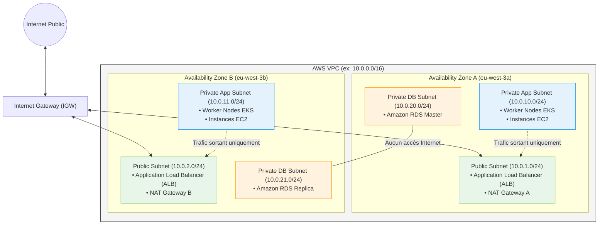

# 06 - AWS Networking (VPC, Subnets, SG, NAT)

Aucune charge de travail (conteneur Kubernetes, machine EC2, base RDS) ne peut tourner sur AWS sans une architecture réseau robuste, hautement disponible et sécurisée. Ce chapitre détaille la conception d'un **VPC d'entreprise Multi-AZ** et son implémentation intégrale en code Terraform HCL.

---

## 1. Architecture Réseau Cible d'Entreprise

Une architecture réseau de production sur AWS ne place jamais les applications dans un réseau plat. Elle sépare le trafic en plusieurs tiers répartis sur au moins **deux zones de disponibilité (Availability Zones - AZ)** pour garantir la haute disponibilité.



!!! info "La Règle des 5 Adresses IP Réservées par AWS dans chaque Subnet"
    Dans n'importe quel sous-réseau AWS (par exemple `10.0.1.0/24`, soit 256 adresses théoriques), vous ne disposez que de **251 adresses utilisables**. AWS réserve toujours 5 adresses :
    
    1. `.0` : Adresse réseau.
    2. `.1` : Routeur virtuel VPC.
    3. `.2` : Serveur DNS d'Amazon (Amazon Provided DNS / Route 53 Resolver).
    4. `.3` : Réservé par AWS pour un usage futur.
    5. `.255` : Adresse de diffusion réseau (Broadcast).

---

## 2. Implémentation Terraform Complète en HCL

Voici le code HCL complet pour déployer cette topologie réseau sans module externe :

```hcl
# 1. Le Virtual Private Cloud (VPC)
resource "aws_vpc" "main" {
  cidr_block           = "10.0.0.0/16"
  enable_dns_support   = true
  enable_dns_hostnames = true

  tags = {
    Name = "production-vpc"
  }
}

# 2. Internet Gateway (Accès bidirectionnel pour le réseau public)
resource "aws_internet_gateway" "igw" {
  vpc_id = aws_vpc.main.id

  tags = {
    Name = "production-igw"
  }
}

# 3. Sous-réseaux Publics (Répartis sur 2 AZs)
resource "aws_subnet" "public_a" {
  vpc_id                  = aws_vpc.main.id
  cidr_block              = "10.0.1.0/24"
  availability_zone       = "eu-west-3a"
  map_public_ip_on_launch = true # Attribue une IP publique aux ressources

  tags = {
    Name                     = "public-eu-west-3a"
    "kubernetes.io/role/elb" = "1" # Tag requis par le Cloud Controller Manager K8s
  }
}

resource "aws_subnet" "public_b" {
  vpc_id                  = aws_vpc.main.id
  cidr_block              = "10.0.2.0/24"
  availability_zone       = "eu-west-3b"
  map_public_ip_on_launch = true

  tags = {
    Name                     = "public-eu-west-3b"
    "kubernetes.io/role/elb" = "1"
  }
}

# 4. Sous-réseaux Privés Applicatifs (Pour EKS / EC2)
resource "aws_subnet" "private_app_a" {
  vpc_id            = aws_vpc.main.id
  cidr_block        = "10.0.10.0/24"
  availability_zone = "eu-west-3a"

  tags = {
    Name                              = "private-app-eu-west-3a"
    "kubernetes.io/role/internal-elb" = "1"
  }
}

resource "aws_subnet" "private_app_b" {
  vpc_id            = aws_vpc.main.id
  cidr_block        = "10.0.11.0/24"
  availability_zone = "eu-west-3b"

  tags = {
    Name                              = "private-app-eu-west-3b"
    "kubernetes.io/role/internal-elb" = "1"
  }
}

# 5. NAT Gateway (Sortie sécurisée vers Internet pour les subnets privés)
resource "aws_eip" "nat" {
  domain     = "vpc"
  depends_on = [aws_internet_gateway.igw]
}

resource "aws_nat_gateway" "nat" {
  allocation_id = aws_eip.nat.id
  subnet_id     = aws_subnet.public_a.id # Doit obligatoirement être en subnet public !

  tags = {
    Name = "production-nat-gw"
  }
}

# 6. Tables de Routage (Route Tables)
# A. Route Table Publique -> Pousse vers l'Internet Gateway
resource "aws_route_table" "public" {
  vpc_id = aws_vpc.main.id

  route {
    cidr_block = "0.0.0.0/0"
    gateway_id = aws_internet_gateway.igw.id
  }

  tags = {
    Name = "public-route-table"
  }
}

# B. Route Table Privée -> Pousse le trafic sortant vers la NAT Gateway
resource "aws_route_table" "private" {
  vpc_id = aws_vpc.main.id

  route {
    cidr_block     = "0.0.0.0/0"
    nat_gateway_id = aws_nat_gateway.nat.id
  }

  tags = {
    Name = "private-route-table"
  }
}

# 7. Associations Sous-réseaux <-> Tables de Routage
resource "aws_route_table_association" "pub_a" {
  subnet_id      = aws_subnet.public_a.id
  route_table_id = aws_route_table.public.id
}

resource "aws_route_table_association" "pub_b" {
  subnet_id      = aws_subnet.public_b.id
  route_table_id = aws_route_table.public.id
}

resource "aws_route_table_association" "priv_a" {
  subnet_id      = aws_subnet.private_app_a.id
  route_table_id = aws_route_table.private.id
}

resource "aws_route_table_association" "priv_b" {
  subnet_id      = aws_subnet.private_app_b.id
  route_table_id = aws_route_table.private.id
}
```

---

## 3. Sécurité Réseau : Security Groups vs NACL

En entretien d'architecture Cloud, la différence entre SG et NACL est une question fondamentale :

| Caractéristique | Security Group (SG) | Network ACL (NACL) |
|---|---|---|
| **Niveau d'application** | Interface Réseau Virtuelle (**ENI / Instance / Pod**) | Périmètre du **Sous-réseau (Subnet)** |
| **État (Statefulness)** | **Stateful** (Trafic retour autorisé automatiquement) | **Stateless** (Le retour doit être explicitement autorisé) |
| **Comportement par défaut** | Bloque tout en entrée, autorise tout en sortie | Autorise tout le trafic entrant et sortant |
| **Types de règles** | Uniquement des règles **ALLOW** | Règles **ALLOW** et règles explicites **DENY** |
| **Ordre d'évaluation** | Toutes les règles sont évaluées ensemble | Évaluation séquentielle par numéro d'ordre (règle 100 avant 200) |

### Bonnes Pratiques HCL : Les Règles Standalone

Ne définissez pas les règles en ligne (`inline`) à l'intérieur du bloc `aws_security_group`, car cela empêche de découpler les dépendances et crée des boucles de réconciliation infinies. Utilisez les ressources indépendantes :

```hcl
resource "aws_security_group" "web_lb" {
  name        = "alb-web-sg"
  description = "Controle les acces HTTP vers le Load Balancer"
  vpc_id      = aws_vpc.main.id
}

# Règle d'entrée HTTP (Inbound)
resource "aws_vpc_security_group_ingress_rule" "allow_http" {
  security_group_id = aws_security_group.web_lb.id
  cidr_ipv4         = "0.0.0.0/0"
  from_port         = 80
  ip_protocol       = "tcp"
  to_port           = 80
}

# Règle de sortie globale (Outbound)
resource "aws_vpc_security_group_egress_rule" "allow_all_out" {
  security_group_id = aws_security_group.web_lb.id
  cidr_ipv4         = "0.0.0.0/0"
  ip_protocol       = "-1" # Tous les protocoles
}
```

---

## 4. Alternative de Production : Le Module Officiel AWS VPC

En entreprise, réécrire 30 ressources réseau brutes à la main est redondant. On utilise le module officiel de la communauté Terraform AWS :

```hcl
module "vpc" {
  source  = "terraform-aws-modules/vpc/aws"
  version = "~> 5.0"

  name = "production-vpc"
  cidr = "10.0.0.0/16"

  azs             = ["eu-west-3a", "eu-west-3b"]
  public_subnets  = ["10.0.1.0/24", "10.0.2.0/24"]
  private_subnets = ["10.0.10.0/24", "10.0.11.0/24"]

  # Activation du NAT Gateway (Haute Disponibilité : 1 par AZ en Prod)
  enable_nat_gateway     = true
  single_nat_gateway     = false
  one_nat_gateway_per_az = true

  enable_dns_hostnames = true
  enable_dns_support   = true

  public_subnet_tags = {
    "kubernetes.io/role/elb" = "1"
  }

  private_subnet_tags = {
    "kubernetes.io/role/internal-elb" = "1"
  }
}
```

---

## 5. Notions Avancées d'Entretien Réseau

!!! tip "VPC Endpoints (PrivateLink) vs NAT Gateway"
    **Question typique :** *"Comment vos instances privées peuvent-elles communiquer avec S3 sans payer les frais élevés de transfert de la NAT Gateway ?"*
    **Réponse :** On déploie un **VPC Gateway Endpoint pour S3** (gratuit). Il modifie la table de routage du VPC pour router le trafic vers S3 via le réseau privé d'AWS, contournant totalement la NAT Gateway et augmentant la sécurité (aucun transit sur Internet).

---

## 6. Questions d'Entretien Fréquentes (Niveau Entry-Level)

!!! question "Q: Pourquoi place-t-on la NAT Gateway dans un sous-réseau public et non privé ?"
    La NAT Gateway (Network Address Translation) a pour mission de masquer les adresses IP privées de vos serveurs internes pour leur permettre d'initier des requêtes vers Internet. Pour pouvoir envoyer ce trafic sur Internet et recevoir la réponse, la NAT Gateway doit impérativement posséder une adresse IP publique statique (Elastic IP) et être connectée à une Route Table pointant vers une Internet Gateway (IGW). C'est la définition même d'un sous-réseau public.

!!! question "Q: Si vous configurez un Security Group pour autoriser le port 443 en entrée, devez-vous ajouter une règle de sortie pour le port 443 pour que le serveur réponde ?"
    Non, car les Security Groups sont **Stateful** (à états). Le mécanisme de filtrage mémorise automatiquement les connexions entrantes acceptées et autorise le trafic retour vers le client, quelle que soit la configuration des règles de sortie (egress). À l'inverse, si vous utilisiez une Network ACL (NACL), qui est Stateless, vous devriez obligatoirement créer une règle explicite sur les ports éphémères sortants (1024-65535).

!!! question "Q: Combien d'adresses IP sont réservées par AWS dans un subnet `/28` ?"
    Un bloc `/28` contient 16 adresses IP au total ($2^{32-28} = 16$). AWS réservant toujours 5 adresses dans chaque sous-réseau (.0, .1, .2, .3, .255), il ne reste que $16 - 5 = 11$ adresses IP utilisables pour vos machines ou pods. C'est pourquoi on évite les subnets trop petits pour des clusters Kubernetes (EKS).

!!! question "Q: Quelle est la différence entre VPC Peering et AWS Transit Gateway ?"
    Le **VPC Peering** est une connexion point-à-point directe entre deux VPCs (sans routage transitif : si A est connecté à B et B à C, A ne communique pas avec C). Lorsque le nombre de VPCs explose (ex: 20 VPCs = 190 peerings à gérer), on utilise une **AWS Transit Gateway (TGW)** qui agit comme un routeur en étoile (Hub-and-Spoke), centralisant et simplifiant l'ensemble des flux réseau inter-VPCs et vers les centres de données sur site (Direct Connect / VPN).