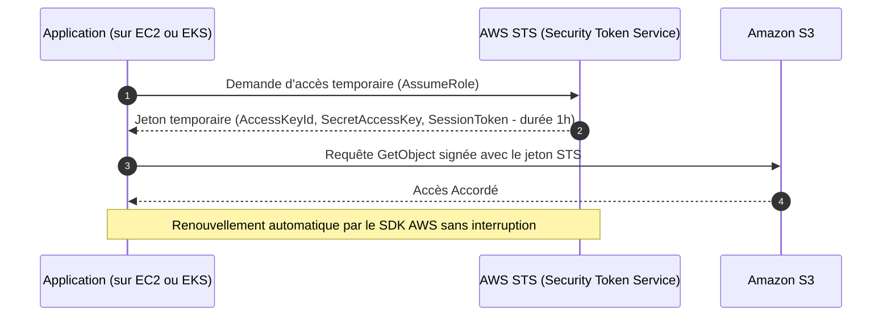
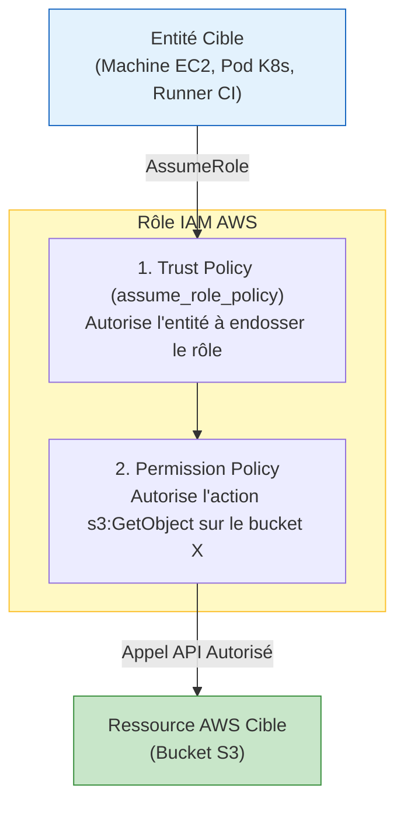
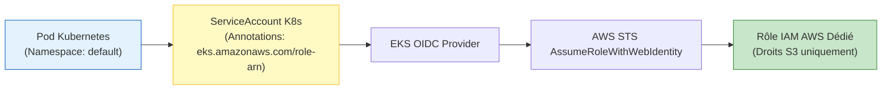

# 07 - AWS IAM & Security (Policies, Roles, IRSA)

In AWS's shared responsibility model, security **OF** the Cloud is ensured by Amazon, but security **IN** the Cloud is entirely your responsibility. **IAM (Identity and Access Management)** is the most sensitive service: a misconfiguration can instantly compromise your entire AWS account and data.

---

## 1. Fundamental Cloud Security Principles

### A. Principle of Least Privilege (PoLP)
Each identity (human, CI/CD pipeline, Kubernetes container) must receive **strictly only the permissions indispensable** to accomplish its task, for the minimum necessary duration, and nothing more. Using wildcards (`Resource: "*"`, `Action: "*"`) in production is an immediate failure in an interview.

### B. Death of Permanent Keys: The Power of IAM Roles
In a modern enterprise:

* **IAM User + Static Access Keys (`AKIA...`):** **Banned.** Static keys inevitably leak into a public Git commit or a CI/CD log.
* **IAM Role + STS (Security Token Service):** **Absolute standard.** A role has no password or permanent key. AWS STS generates temporary cryptographic credentials valid from a few minutes to a few hours.



---

## 2. Anatomy of an IAM Role: Trust Policy vs Permission Policy

An IAM role consists of two distinct building blocks that must never be confused:

1. **Trust Policy (`assume_role_policy`):** Answers the question: *"WHO is allowed to assume this role?"* (Example: the EC2 service, the Lambda service, or an EKS cluster via OIDC).
2. **Permission Policy:** Answers the question: *"WHAT? Which actions is this role allowed to perform on which AWS resources?"*



---

## 3. Clean Terraform HCL Implementation

!!! tip "Why prefer `data.aws_iam_policy_document` over `jsonencode`?"
    Although writing raw JSON with `jsonencode` is supported, the professional best practice is to use the **`aws_iam_policy_document`** data source:
    
    - Syntax checking by Terraform as early as the `plan` step.
    - No risk of typing errors or misplaced JSON commas.
    - Easy merging of multiple policies via the `source_policy_documents` argument.

### Example: Giving an EC2 Instance Read Access to an S3 Bucket

```hcl
# 1. Définition de la Trust Policy (Autorise le service EC2 à assumer le rôle)
data "aws_iam_policy_document" "ec2_assume_role" {
  statement {
    effect  = "Allow"
    actions = ["sts:AssumeRole"]

    principals {
      type        = "Service"
      identifiers = ["ec2.amazonaws.com"]
    }
  }
}

# 2. Création du Rôle IAM
resource "aws_iam_role" "app_server_role" {
  name               = "app-server-role"
  assume_role_policy = data.aws_iam_policy_document.ec2_assume_role.json

  tags = {
    Environment = "production"
  }
}

# 3. Définition de la Permission Policy (Lecture seule sur le bucket spécifique)
data "aws_iam_policy_document" "s3_read_only" {
  statement {
    effect = "Allow"
    actions = [
      "s3:GetObject",
      "s3:ListBucket"
    ]
    resources = [
      "arn:aws:s3:::mon-bucket-application-prod",
      "arn:aws:s3:::mon-bucket-application-prod/*"
    ]
  }
}

resource "aws_iam_policy" "s3_read_policy" {
  name        = "AppServerS3ReadOnlyPolicy"
  description = "Autorise la lecture des fichiers applicatifs sur S3"
  policy      = data.aws_iam_policy_document.s3_read_only.json
}

# 4. Attachement de la Policy au Rôle
resource "aws_iam_role_policy_attachment" "attach_s3" {
  role       = aws_iam_role.app_server_role.name
  policy_arn = aws_iam_policy.s3_read_policy.arn
}

# 5. Instance Profile (Obligatoire pour lier un rôle IAM à une instance EC2)
resource "aws_iam_instance_profile" "app_profile" {
  name = "app-server-instance-profile"
  role = aws_iam_role.app_server_role.name
}

# 6. Attachement à l'instance EC2
resource "aws_instance" "app_node" {
  ami                  = "ami-0abcdef1234567890"
  instance_type        = "t3.micro"
  iam_instance_profile = aws_iam_instance_profile.app_profile.name
}
```

---

## 4. EKS Deep Dive: IRSA (IAM Roles for Service Accounts)

In a Kubernetes cluster (Amazon EKS), a major security challenge arises:

* **The problem:** If you attach an IAM role to the EC2 node (Worker Node), **ALL Pods** hosted on that machine inherit the same Cloud permissions! If an unprivileged container is compromised, the attacker gains access to your database or S3 bucket.
* **The solution:** **IRSA (IAM Roles for Service Accounts)**. IRSA associates an IAM Role directly with a Kubernetes `ServiceAccount` via the **OIDC (OpenID Connect)** protocol.



### IRSA Terraform HCL Configuration

```hcl
# 1. Récupération des informations du cluster EKS existant
data "aws_eks_cluster" "eks" {
  name = "mon-cluster-production"
}

# 2. Trust Policy conditionnée sur le ServiceAccount K8s précis
data "aws_iam_policy_document" "irsa_trust" {
  statement {
    effect  = "Allow"
    actions = ["sts:AssumeRoleWithWebIdentity"]

    principals {
      type        = "Federated"
      identifiers = [data.aws_eks_cluster.eks.identity[0].oidc[0].issuer]
    }

    # Condition de sécurité stricte : seul ce SA dans ce namespace peut assumer le rôle
    condition {
      test     = "StringEquals"
      variable = "${replace(data.aws_eks_cluster.eks.identity[0].oidc[0].issuer, "https://", "")}:sub"
      values   = ["system:serviceaccount:production:payment-service-sa"]
    }
  }
}

# 3. Création du rôle IAM pour le Pod
resource "aws_iam_role" "payment_service_irsa" {
  name               = "eks-payment-service-irsa-role"
  assume_role_policy = data.aws_iam_policy_document.irsa_trust.json
}
```

In Kubernetes, simply annotate the ServiceAccount:
```yaml
apiVersion: v1
kind: ServiceAccount
metadata:
  name: payment-service-sa
  namespace: production
  annotations:
    eks.amazonaws.com/role-arn: arn:aws:iam::123456789012:role/eks-payment-service-irsa-role
```

!!! info "Modern Evolution: EKS Pod Identity (Late 2023+)"
    Although IRSA is still ubiquitous in interviews, AWS introduced **EKS Pod Identity**, which further simplifies this process by eliminating the need to manually handle OIDC Provider URLs in Trust Policies.

---

## 5. Frequently Asked Interview Questions (Entry-Level)

!!! question "Q: Why should you never use permanent access keys (Access Keys) on EC2 machines or EKS clusters?"
    Permanent access keys (`AWS_ACCESS_KEY_ID` / `AWS_SECRET_ACCESS_KEY`) represent a critical compromise risk: they do not rotate automatically and can leak into code or logs. Best practice is to use **IAM Roles** with instance profiles or IRSA. The AWS STS service then issues ephemeral tokens that are automatically renewed by the AWS SDK without any manual secret management.

!!! question "Q: What is the difference between a Trust Policy and a Permission Policy in an IAM Role?"
    The **Trust Policy** (defined by `assume_role_policy`) indicates **WHO** is authorized to assume the role (for example an AWS service like `ec2.amazonaws.com` or an external identity provider like GitHub Actions / OIDC EKS). The **Permission Policy** indicates **WHAT**: i.e., the set of concrete actions (read, write, delete) the authorized entity will be able to perform on AWS resources once the role is assumed.

!!! question "Q: What is IRSA and what security problem does it solve on Amazon EKS?"
    IRSA stands for *IAM Roles for Service Accounts*. Without IRSA, AWS permissions are granted at the EC2 node level (the Worker Node), meaning any co-located Pod on that server inherits the same privileges. IRSA uses OIDC federation to grant IAM permissions at the granular level of each individual Pod via its Kubernetes `ServiceAccount`, thus strictly adhering to the principle of least privilege.

!!! question "Q: Why favor `data.aws_iam_policy_document` over raw JSON in Terraform?"
    The `aws_iam_policy_document` data source offers direct syntax and semantic checking during `terraform plan`, avoiding JSON syntax errors discovered late at runtime. It also allows composing modular policies (merging, complex conditions) and benefits from HCL autocompletion while facilitating reuse of security policy fragments across multiple projects.
