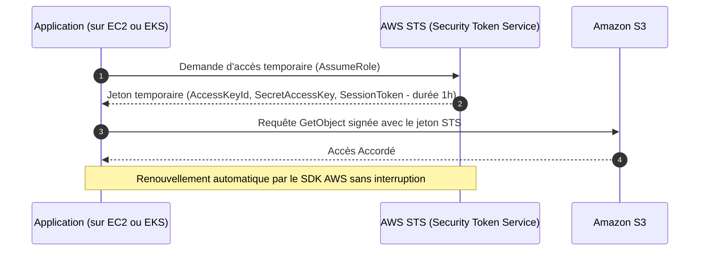
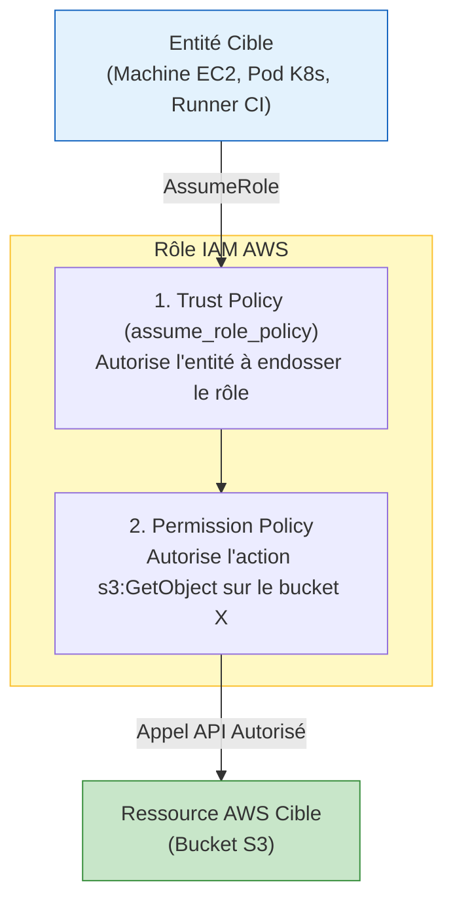
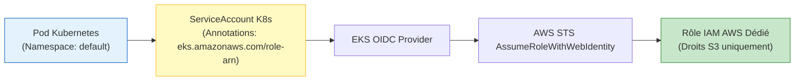

# 07 - AWS IAM & Sécurité (Policies, Roles, IRSA)

Dans le modèle de responsabilité partagée d'AWS, la sécurité **DU** Cloud est assurée par Amazon, mais la sécurité **DANS** le Cloud relève de votre entière responsabilité. **IAM (Identity and Access Management)** est le service le plus sensible : une faille de configuration IAM peut compromettre instantanément l'ensemble de votre compte AWS et de vos données.

---

## 1. Principes Fondamentaux de la Sécurité Cloud

### A. Le Principe du Moindre Privilège (Principle of Least Privilege - PoLP)
Chaque identité (humain, pipeline CI/CD, conteneur Kubernetes) ne doit recevoir **strictement que les permissions indispensables** à l'accomplissement de sa tâche, pour la durée minimale nécessaire, et rien de plus. L'usage de wildcards (`Resource: "*"`, `Action: "*"`) en production est une faute éliminatoire en entretien.

### B. Mort des Clés Permanentes : La Puissance des IAM Roles
En entreprise moderne :
* **IAM User + Access Keys statiques (`AKIA...`) :** **Banni.** Les clés statiques finissent inévitablement par fuiter dans un commit Git public ou un log CI/CD.
* **IAM Role + STS (Security Token Service) :** **Standard absolu.** Un rôle ne possède aucun mot de passe ni clé permanente. AWS STS génère des identifiants temporaires cryptographiques valides de quelques minutes à quelques heures.



---

## 2. Anatomie d'un Rôle IAM : Trust Policy vs Permission Policy

Un rôle IAM est composé de deux briques distinctes qu'il ne faut jamais confondre :

1. **Trust Policy (`assume_role_policy`) :** Répond à la question : *"QUI a le droit d'endosser ce rôle ?"* (Exemple : le service EC2, le service Lambda, ou un cluster EKS via OIDC).
2. **Permission Policy :** Répond à la question : *"QUOI ? Quelles actions ce rôle a-t-il le droit d'effectuer sur quelles ressources AWS ?"*



---

## 3. Implémentation Terraform HCL Propre

!!! tip "Pourquoi préférer `data.aws_iam_policy_document` à `jsonencode` ?"
    Bien qu'écrire du JSON brut avec `jsonencode` soit supporté, la bonne pratique professionnelle est d'utiliser la data source **`aws_iam_policy_document`** :
    - Vérification syntaxique par Terraform dès l'étape `plan`.
    - Pas de risque d'erreur de typage ou de virgule JSON mal placée.
    - Facilité de fusion de politiques multiples via l'argument `source_policy_documents`.

### Exemple : Donner à une instance EC2 l'accès en lecture à un Bucket S3

```hcl
# 1. Définition de la Trust Policy (Autorise le service EC2 à assumer le rôle)
data "aws_iam_policy_document" "ec2_assume_role" {
  statement {
    effect  = "Allow"
    actions = ["sts:AssumeRole"]

    principals {
      type        = "Service"
      identifiers = ["ec2.amazonaws.com"]
    }
  }
}

# 2. Création du Rôle IAM
resource "aws_iam_role" "app_server_role" {
  name               = "app-server-role"
  assume_role_policy = data.aws_iam_policy_document.ec2_assume_role.json

  tags = {
    Environment = "production"
  }
}

# 3. Définition de la Permission Policy (Lecture seule sur le bucket spécifique)
data "aws_iam_policy_document" "s3_read_only" {
  statement {
    effect = "Allow"
    actions = [
      "s3:GetObject",
      "s3:ListBucket"
    ]
    resources = [
      "arn:aws:s3:::mon-bucket-application-prod",
      "arn:aws:s3:::mon-bucket-application-prod/*"
    ]
  }
}

resource "aws_iam_policy" "s3_read_policy" {
  name        = "AppServerS3ReadOnlyPolicy"
  description = "Autorise la lecture des fichiers applicatifs sur S3"
  policy      = data.aws_iam_policy_document.s3_read_only.json
}

# 4. Attachement de la Policy au Rôle
resource "aws_iam_role_policy_attachment" "attach_s3" {
  role       = aws_iam_role.app_server_role.name
  policy_arn = aws_iam_policy.s3_read_policy.arn
}

# 5. Instance Profile (Obligatoire pour lier un rôle IAM à une instance EC2)
resource "aws_iam_instance_profile" "app_profile" {
  name = "app-server-instance-profile"
  role = aws_iam_role.app_server_role.name
}

# 6. Attachement à l'instance EC2
resource "aws_instance" "app_node" {
  ami                  = "ami-0abcdef1234567890"
  instance_type        = "t3.micro"
  iam_instance_profile = aws_iam_instance_profile.app_profile.name
}
```

---

## 4. Deep Dive EKS : IRSA (IAM Roles for Service Accounts)

Dans un cluster Kubernetes (Amazon EKS), une problématique de sécurité majeure se pose :
* **Le problème :** Si vous attachez un rôle IAM au nœud EC2 (Worker Node), **TOUS les Pods** hébergés sur cette machine héritent des mêmes permissions Cloud ! Si un conteneur non privilégié est compromis, l'attaquant a accès à votre base de données ou à votre bucket S3.
* **La solution :** **IRSA (IAM Roles for Service Accounts)**. IRSA associe un Rôle IAM directement à un `ServiceAccount` Kubernetes via le protocole **OIDC (OpenID Connect)**.



### Configuration Terraform HCL d'IRSA

```hcl
# 1. Récupération des informations du cluster EKS existant
data "aws_eks_cluster" "eks" {
  name = "mon-cluster-production"
}

# 2. Trust Policy conditionnée sur le ServiceAccount K8s précis
data "aws_iam_policy_document" "irsa_trust" {
  statement {
    effect  = "Allow"
    actions = ["sts:AssumeRoleWithWebIdentity"]

    principals {
      type        = "Federated"
      identifiers = [data.aws_eks_cluster.eks.identity[0].oidc[0].issuer]
    }

    # Condition de sécurité stricte : seul ce SA dans ce namespace peut assumer le rôle
    condition {
      test     = "StringEquals"
      variable = "${replace(data.aws_eks_cluster.eks.identity[0].oidc[0].issuer, "https://", "")}:sub"
      values   = ["system:serviceaccount:production:payment-service-sa"]
    }
  }
}

# 3. Création du rôle IAM pour le Pod
resource "aws_iam_role" "payment_service_irsa" {
  name               = "eks-payment-service-irsa-role"
  assume_role_policy = data.aws_iam_policy_document.irsa_trust.json
}
```

Dans Kubernetes, il suffit d'annoter le ServiceAccount :
```yaml
apiVersion: v1
kind: ServiceAccount
metadata:
  name: payment-service-sa
  namespace: production
  annotations:
    eks.amazonaws.com/role-arn: arn:aws:iam::123456789012:role/eks-payment-service-irsa-role
```

!!! info "Évolution moderne : EKS Pod Identity (Fin 2023+)"
    Bien qu'IRSA soit encore omniprésent en entretien, AWS a introduit **EKS Pod Identity**, qui simplifie encore ce processus en éliminant le besoin de manipuler manuellement les URLs d'OIDC Provider dans les Trust Policies.

---

## 5. Questions d'Entretien Fréquentes (Niveau Entry-Level)

!!! question "Q: Pourquoi ne doit-on jamais utiliser de clés d'accès permanentes (Access Keys) sur des machines EC2 ou des clusters EKS ?"
    Les clés d'accès permanentes (`AWS_ACCESS_KEY_ID` / `AWS_SECRET_ACCESS_KEY`) représentent un risque critique de compromission : elles ne tournent pas automatiquement et peuvent fuiter dans du code ou des logs. La bonne pratique est d'utiliser des **IAM Roles** avec des profils d'instance ou IRSA. Le service AWS STS délivre alors des jetons éphémères qui sont automatiquement renouvelés par le SDK AWS sans aucune gestion manuelle de secret.

!!! question "Q: Quelle est la différence entre une Trust Policy et une Permission Policy dans un Rôle IAM ?"
    La **Trust Policy** (définie par `assume_role_policy`) indique **QUI** a l'autorisation d'endosser le rôle (par exemple un service AWS comme `ec2.amazonaws.com` ou un fournisseur d'identité externe comme GitHub Actions / OIDC EKS). La **Permission Policy** indique **QUOI** : c'est-à-dire l'ensemble des actions concrètes (lecture, écriture, suppression) que l'entité autorisée pourra effectuer sur les ressources AWS une fois le rôle assumé.

!!! question "Q: Qu'est-ce qu'IRSA et quel problème de sécurité résout-il sur Amazon EKS ?"
    IRSA signifie *IAM Roles for Service Accounts*. Sans IRSA, les permissions AWS sont attribuées au niveau du nœud EC2 (le Worker Node), ce qui signifie que n'importe quel Pod colocalisé sur ce serveur hérite des mêmes privilèges. IRSA utilise la fédération OIDC pour attribuer des permissions IAM au niveau granulaire de chaque Pod individuel via son `ServiceAccount` Kubernetes, respectant ainsi strictement le principe du moindre privilège.

!!! question "Q: Pourquoi privilégier `data.aws_iam_policy_document` plutôt que du JSON brut dans Terraform ?"
    La data source `aws_iam_policy_document` offre une vérification syntaxique et sémantique directe lors du `terraform plan`, évitant les erreurs de syntaxe JSON découvertes tardivement à l'exécution. Elle permet également de composer des politiques modulaires (fusion, conditions complexes) et de bénéficier de l'autocomplétion HCL tout en facilitant la réutilisation de fragments de politiques de sécurité à travers plusieurs projets.
