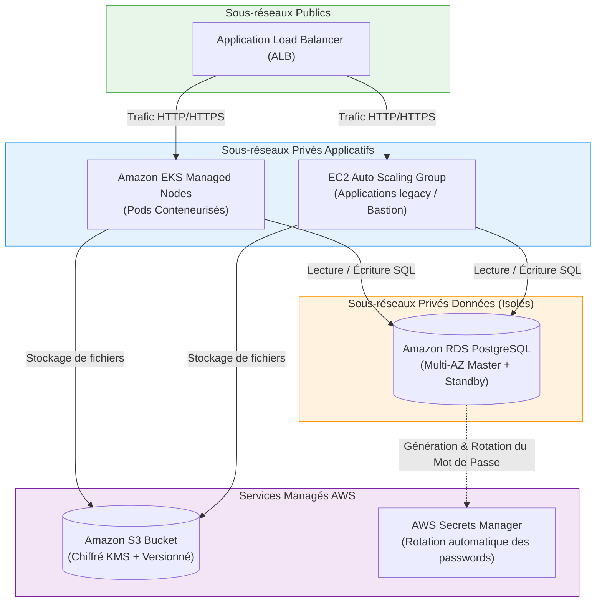

# 08 - Cloud Provisioning (EKS, EC2, S3, RDS)

After mastering networking (VPC) and identities (IAM), the DevOps engineer assembles compute (**Compute**), object storage (**Storage**), and relational database (**Database**) building blocks. This chapter presents production Terraform HCL manifests to deploy a complete and secure enterprise Cloud stack.

---

## 1. Overall Cloud Stack Architecture



---

## 2. Amazon EKS (Elastic Kubernetes Service)

Provisioning a Kubernetes cluster from scratch is a complex challenge (managing etcd, TLS certificates, Control Plane high availability). EKS abstracts the Control Plane.

In an enterprise, the standard **`terraform-aws-modules/eks/aws`** module (v20+) is used to deploy robust clusters:

```hcl
module "eks" {
  source  = "terraform-aws-modules/eks/aws"
  version = "~> 20.0"

  cluster_name    = "production-eks-cluster"
  cluster_version = "1.30"

  # Le cluster est accessible publiquement mais limité par endpoint privé
  cluster_endpoint_public_access  = true
  cluster_endpoint_private_access = true

  vpc_id     = module.vpc.vpc_id
  subnet_ids = module.vpc.private_subnets # Les nœuds tournent impérativement en réseau privé !

  # Chiffrement natif des secrets Kubernetes via une clé AWS KMS
  create_kms_key = true
  cluster_encryption_config = {
    resources = ["secrets"]
  }

  # Nœuds Managés (Managed Node Groups) avec stratégie On-Demand et Spot
  eks_managed_node_groups = {
    # Pool principal pour les charges critiques
    system = {
      name           = "system-nodes"
      instance_types = ["t3.medium"]
      min_size       = 2
      max_size       = 5
      desired_size   = 2

      capacity_type = "ON_DEMAND"
    }

    # Pool secondaire Spot pour réduire les coûts sur les tâches non critiques
    spot_workers = {
      name           = "spot-workers"
      instance_types = ["t3.large", "t3a.large"]
      min_size       = 1
      max_size       = 10
      desired_size   = 2

      capacity_type = "SPOT"
    }
  }

  # Activation du mode moderne d'authentification EKS (remplace l'ancien aws-auth ConfigMap)
  enable_cluster_creator_admin_permissions = true
}
```

---

## 3. Amazon EC2 & Auto Scaling Group (ASG)

For monolithic applications or bastion servers that require autoscaling without containers:

```hcl
# 1. Launch Template (Modèle de démarrage immuable)
resource "aws_launch_template" "app_template" {
  name_prefix   = "app-launch-template-"
  image_id      = data.aws_ami.ubuntu_latest.id
  instance_type = "t3.micro"

  iam_instance_profile {
    name = aws_iam_instance_profile.app_profile.name
  }

  network_interfaces {
    associate_public_ip_address = false
    security_groups             = [aws_security_group.app_sg.id]
  }

  user_data = base64encode(<<-EOF
              #!/bin/bash
              echo "Hello from Terraform Instance" > /var/www/html/index.html
              EOF
  )

  lifecycle {
    create_before_destroy = true
  }
}

# 2. Auto Scaling Group (Gestion du parc d'instances)
resource "aws_autoscaling_group" "app_asg" {
  name_prefix         = "production-asg-"
  vpc_zone_identifier = module.vpc.private_subnets
  target_group_arns   = [aws_lb_target_group.app_tg.arn]

  min_size     = 2
  max_size     = 6
  desired_size = 2

  launch_template {
    id      = aws_launch_template.app_template.id
    version = "$Latest"
  }

  instance_refresh {
    strategy = "Rolling"
    preferences {
      min_healthy_percentage = 50
    }
  }
}
```

---

## 4. Hardened Amazon S3 for Production

An enterprise S3 bucket must include protection against accidental deletion, KMS encryption, and lifecycle rules:

```hcl
# 1. Bucket S3
resource "aws_s3_bucket" "app_data" {
  bucket = "mon-entreprise-production-storage-2026"

  lifecycle {
    prevent_destroy = true # Sécurité absolue en production
  }
}

# 2. Versioning des objets
resource "aws_s3_bucket_versioning" "app_data_versioning" {
  bucket = aws_s3_bucket.app_data.id
  versioning_configuration {
    status = "Enabled"
  }
}

# 3. Chiffrement SSE-KMS au repos
resource "aws_s3_bucket_server_side_encryption_configuration" "app_data_crypto" {
  bucket = aws_s3_bucket.app_data.id
  rule {
    apply_server_side_encryption_by_default {
      sse_algorithm = "aws:kms"
    }
  }
}

# 4. Blocage total d'accès public
resource "aws_s3_bucket_public_access_block" "app_data_privacy" {
  bucket                  = aws_s3_bucket.app_data.id
  block_public_acls       = true
  block_public_policy     = true
  ignore_public_acls      = true
  restrict_public_buckets = true
}

# 5. Cycle de vie des données (Archivage automatique vers Glacier pour réduire les coûts)
resource "aws_s3_bucket_lifecycle_configuration" "archive_rules" {
  bucket = aws_s3_bucket.app_data.id

  rule {
    id     = "archive-old-objects"
    status = "Enabled"

    transition {
      days          = 90
      storage_class = "STANDARD_IA" # Accès peu fréquent
    }

    transition {
      days          = 365
      storage_class = "GLACIER"     # Archivage froid économique
    }
  }
}
```

---

## 5. Amazon RDS (Managed PostgreSQL Database)

!!! danger "RDS Password Management: The Golden Rule"
    **Never** hardcode a password in Terraform code. Use native AWS integration with **AWS Secrets Manager** (`manage_master_user_password = true`), where AWS generates, stores, and automatically rotates the password autonomously.

```hcl
# 1. Groupe de sous-réseaux (Strictement dans les Subnets Privés !)
resource "aws_db_subnet_group" "rds_subnets" {
  name        = "production-rds-subnet-group"
  subnet_ids  = module.vpc.database_subnets
  description = "Sous-reseaux isoles pour RDS sans route Internet"
}

# 2. Instance RDS PostgreSQL Multi-AZ
resource "aws_db_instance" "postgres" {
  identifier        = "production-postgres-db"
  engine            = "postgres"
  engine_version    = "16.1"
  instance_class    = "db.t4g.medium" # Processeur ARM Graviton économique et performant
  allocated_storage = 50

  db_name  = "production_db"
  username = "dbadmin"

  # Gestion autonome du mot de passe par AWS Secrets Manager (Fin des secrets dans le State !)
  manage_master_user_password = true

  # Haute Disponibilité
  multi_az = true # Déploie une instance répliquée dans une 2e AZ

  # Réseau & Sécurité
  db_subnet_group_name   = aws_db_subnet_group.rds_subnets.name
  vpc_security_group_ids = [aws_security_group.db_sg.id]
  publicly_accessible    = false

  # Sécurité des données
  storage_encrypted   = true
  deletion_protection = true # Empêche la suppression par mégarde
  skip_final_snapshot = false
  final_snapshot_identifier = "production-postgres-final-snapshot"

  tags = {
    Environment = "production"
  }
}
```

---

## 6. Frequently Asked Interview Questions (Entry-Level)

!!! question "Q: Why must RDS instances and EKS nodes be deployed in private subnets?"
    To apply defense in depth. Relational databases and internal application servers must never be directly reachable from the Internet, otherwise they are exposed to brute-force attacks or vulnerability scans. Inbound traffic must go through a Load Balancer (ALB) located in a public subnet, which acts as a reverse proxy and application firewall.

!!! question "Q: What does `multi_az = true` do on Amazon RDS and how does it behave on failure?"
    The Multi-AZ option automatically provisions a second synchronous database instance (Standby) in another Availability Zone (AZ). In case of hardware failure of the primary instance or a complete AZ outage, AWS triggers an automatic failover in under 60 seconds by updating the database's DNS CNAME record. No code or IP address change is required on the application side.

!!! question "Q: How do you securely handle the administrator password of an RDS database with Terraform without exposing it in code?"
    The modern method recommended by AWS is to enable the `manage_master_user_password = true` argument in the `aws_db_instance` resource. AWS then generates a cryptographically secure password and stores it directly in AWS Secrets Manager with a dedicated KMS key. The application then retrieves the password at runtime via the AWS SDK or IRSA without the password ever being written in an HCL file or manually injected.

!!! question "Q: What is the difference between On-Demand and Spot EC2 instances in an EKS cluster?"
    **On-Demand** instances have a fixed price and guaranteed availability from AWS: they are reserved for critical workloads (K8s Control Plane, database pods). **Spot** instances come from AWS's unused excess capacity, sold at discounts of up to 90%, but AWS can reclaim them with 2 minutes' notice. They are used for batch processing nodes or fault-tolerant application pods configured with multiple replicas.
