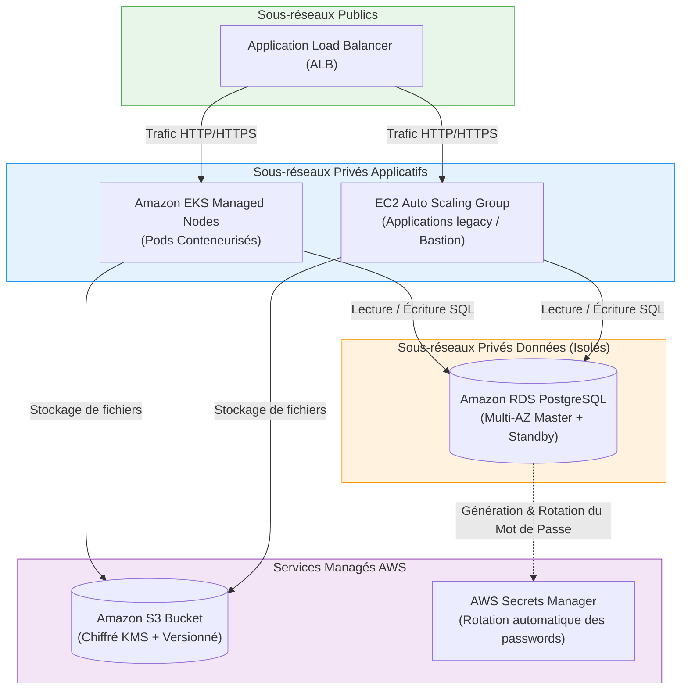

# 08 - Provisionnement Cloud (EKS, EC2, S3, RDS)

Après avoir maîtrisé le réseau (VPC) et les identités (IAM), l'ingénieur DevOps assemble les briques de calcul (**Compute**), de stockage objet (**Storage**) et de bases relationnelles (**Database**). Ce chapitre présente les manifestes Terraform HCL de production pour déployer une stack Cloud d'entreprise complète et sécurisée.

---

## 1. Architecture d'Ensemble de la Stack Cloud



---

## 2. Amazon EKS (Elastic Kubernetes Service)

Provisionner un cluster Kubernetes de zéro est un défi complexe (gestion d'etcd, certificats TLS, haute disponibilité du Control Plane). EKS abstrait le Control Plane.

En entreprise, on utilise le module standard **`terraform-aws-modules/eks/aws`** (v20+) pour déployer des clusters robustes :

```hcl
module "eks" {
  source  = "terraform-aws-modules/eks/aws"
  version = "~> 20.0"

  cluster_name    = "production-eks-cluster"
  cluster_version = "1.30"

  # Le cluster est accessible publiquement mais limité par endpoint privé
  cluster_endpoint_public_access  = true
  cluster_endpoint_private_access = true

  vpc_id     = module.vpc.vpc_id
  subnet_ids = module.vpc.private_subnets # Les nœuds tournent impérativement en réseau privé !

  # Chiffrement natif des secrets Kubernetes via une clé AWS KMS
  create_kms_key = true
  cluster_encryption_config = {
    resources = ["secrets"]
  }

  # Nœuds Managés (Managed Node Groups) avec stratégie On-Demand et Spot
  eks_managed_node_groups = {
    # Pool principal pour les charges critiques
    system = {
      name           = "system-nodes"
      instance_types = ["t3.medium"]
      min_size       = 2
      max_size       = 5
      desired_size   = 2

      capacity_type = "ON_DEMAND"
    }

    # Pool secondaire Spot pour réduire les coûts sur les tâches non critiques
    spot_workers = {
      name           = "spot-workers"
      instance_types = ["t3.large", "t3a.large"]
      min_size       = 1
      max_size       = 10
      desired_size   = 2

      capacity_type = "SPOT"
    }
  }

  # Activation du mode moderne d'authentification EKS (remplace l'ancien aws-auth ConfigMap)
  enable_cluster_creator_admin_permissions = true
}
```

---

## 3. Amazon EC2 & Auto Scaling Group (ASG)

Pour les applications monolithiques ou les serveurs bastions qui nécessitent de l'autoscaling sans conteneurs :

```hcl
# 1. Launch Template (Modèle de démarrage immuable)
resource "aws_launch_template" "app_template" {
  name_prefix   = "app-launch-template-"
  image_id      = data.aws_ami.ubuntu_latest.id
  instance_type = "t3.micro"

  iam_instance_profile {
    name = aws_iam_instance_profile.app_profile.name
  }

  network_interfaces {
    associate_public_ip_address = false
    security_groups             = [aws_security_group.app_sg.id]
  }

  user_data = base64encode(<<-EOF
              #!/bin/bash
              echo "Hello from Terraform Instance" > /var/www/html/index.html
              EOF
  )

  lifecycle {
    create_before_destroy = true
  }
}

# 2. Auto Scaling Group (Gestion du parc d'instances)
resource "aws_autoscaling_group" "app_asg" {
  name_prefix         = "production-asg-"
  vpc_zone_identifier = module.vpc.private_subnets
  target_group_arns   = [aws_lb_target_group.app_tg.arn]

  min_size     = 2
  max_size     = 6
  desired_size = 2

  launch_template {
    id      = aws_launch_template.app_template.id
    version = "$Latest"
  }

  instance_refresh {
    strategy = "Rolling"
    preferences {
      min_healthy_percentage = 50
    }
  }
}
```

---

## 4. Amazon S3 Durci pour la Production

Un bucket S3 d'entreprise doit intégrer la protection contre la suppression accidentelle, le chiffrement KMS et des règles de cycle de vie :

```hcl
# 1. Bucket S3
resource "aws_s3_bucket" "app_data" {
  bucket = "mon-entreprise-production-storage-2026"

  lifecycle {
    prevent_destroy = true # Sécurité absolue en production
  }
}

# 2. Versioning des objets
resource "aws_s3_bucket_versioning" "app_data_versioning" {
  bucket = aws_s3_bucket.app_data.id
  versioning_configuration {
    status = "Enabled"
  }
}

# 3. Chiffrement SSE-KMS au repos
resource "aws_s3_bucket_server_side_encryption_configuration" "app_data_crypto" {
  bucket = aws_s3_bucket.app_data.id
  rule {
    apply_server_side_encryption_by_default {
      sse_algorithm = "aws:kms"
    }
  }
}

# 4. Blocage total d'accès public
resource "aws_s3_bucket_public_access_block" "app_data_privacy" {
  bucket                  = aws_s3_bucket.app_data.id
  block_public_acls       = true
  block_public_policy     = true
  ignore_public_acls      = true
  restrict_public_buckets = true
}

# 5. Cycle de vie des données (Archivage automatique vers Glacier pour réduire les coûts)
resource "aws_s3_bucket_lifecycle_configuration" "archive_rules" {
  bucket = aws_s3_bucket.app_data.id

  rule {
    id     = "archive-old-objects"
    status = "Enabled"

    transition {
      days          = 90
      storage_class = "STANDARD_IA" # Accès peu fréquent
    }

    transition {
      days          = 365
      storage_class = "GLACIER"     # Archivage froid économique
    }
  }
}
```

---

## 5. Amazon RDS (Base de Données PostgreSQL Managée)

!!! danger "Gestion des Mots de Passe RDS : La Règle d'Or"
    Ne codez **jamais** un mot de passe en clair dans le code Terraform. Utilisez l'intégration native AWS avec **AWS Secrets Manager** (`manage_master_user_password = true`), où AWS génère, stocke et gère la rotation du mot de passe de façon 100% autonome.

```hcl
# 1. Groupe de sous-réseaux (Strictement dans les Subnets Privés !)
resource "aws_db_subnet_group" "rds_subnets" {
  name        = "production-rds-subnet-group"
  subnet_ids  = module.vpc.database_subnets
  description = "Sous-reseaux isoles pour RDS sans route Internet"
}

# 2. Instance RDS PostgreSQL Multi-AZ
resource "aws_db_instance" "postgres" {
  identifier        = "production-postgres-db"
  engine            = "postgres"
  engine_version    = "16.1"
  instance_class    = "db.t4g.medium" # Processeur ARM Graviton économique et performant
  allocated_storage = 50

  db_name  = "production_db"
  username = "dbadmin"

  # Gestion autonome du mot de passe par AWS Secrets Manager (Fin des secrets dans le State !)
  manage_master_user_password = true

  # Haute Disponibilité
  multi_az = true # Déploie une instance répliquée dans une 2e AZ

  # Réseau & Sécurité
  db_subnet_group_name   = aws_db_subnet_group.rds_subnets.name
  vpc_security_group_ids = [aws_security_group.db_sg.id]
  publicly_accessible    = false

  # Sécurité des données
  storage_encrypted   = true
  deletion_protection = true # Empêche la suppression par mégarde
  skip_final_snapshot = false
  final_snapshot_identifier = "production-postgres-final-snapshot"

  tags = {
    Environment = "production"
  }
}
```

---

## 6. Questions d'Entretien Fréquentes (Niveau Entry-Level)

!!! question "Q: Pourquoi déploie-t-on impérativement les instances RDS et les nœuds EKS dans des sous-réseaux privés ?"
    Pour appliquer le principe de défense en profondeur. Les bases de données relationnelles et les serveurs applicatifs internes ne doivent jamais être directement adressables depuis Internet, sous peine d'exposition à des attaques par force brute ou à des scans de vulnérabilités. Le trafic entrant passe obligatoirement par un Load Balancer (ALB) situé dans un sous-réseau public, qui agit comme reverse-proxy et pare-feu applicatif.

!!! question "Q: Qu'est-ce que l'option `multi_az = true` sur Amazon RDS et quel est son comportement en cas de panne ?"
    L'option Multi-AZ provisionne automatiquement une seconde instance de base de données synchrone (Standby) dans une autre zone de disponibilité (AZ). En cas de panne matérielle de l'instance principale ou de panne complète de l'AZ, AWS déclenche un basculement automatique (Failover) en moins de 60 secondes en modifiant l'enregistrement DNS CNAME de la base de données. Il n'y a aucune modification de code ou d'adresse IP requise côté application.

!!! question "Q: Comment gérer de manière sécurisée le mot de passe administrateur d'une base RDS avec Terraform sans l'exposer dans le code ?"
    La méthode moderne recommandée par AWS consiste à activer l'argument `manage_master_user_password = true` dans la ressource `aws_db_instance`. AWS génère alors un mot de passe cryptographiquement sûr et le stocke directement dans AWS Secrets Manager avec une clé KMS dédiée. L'application récupère ensuite le mot de passe au runtime via le SDK AWS ou IRSA sans que le mot de passe n'ait jamais été écrit dans un fichier HCL ni injecté manuellement.

!!! question "Q: Quelle est la différence entre les instances EC2 On-Demand et Spot dans un cluster EKS ?"
    Les instances **On-Demand** ont un tarif fixe et une disponibilité garantie par AWS : elles sont réservées aux charges critiques (Control Plane K8s, pods de base de données). Les instances **Spot** sont issues des capacités excédentaires inutilisées d'AWS, vendues avec des réductions allant jusqu'à 90%, mais AWS peut les réclamer avec un préavis de 2 minutes. On les utilise pour les nœuds de traitement par lots ou les pods applicatifs tolérants aux pannes configurés avec des replicas multiples.