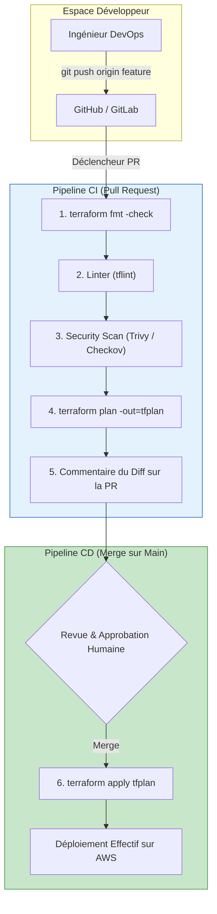
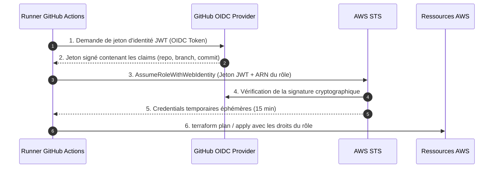

# 09 - Automation (Terraform via CI/CD)

In an enterprise environment, running `terraform apply` from your laptop is strictly forbidden: it creates major security (local access keys), traceability, and overwrite risks. Any infrastructure change must go through a Continuous Integration and Deployment (**CI/CD**) pipeline.

---

## 1. Enterprise IaC Workflow

The infrastructure automation pipeline separates the cycle into two distinct phases:

1. **Pull Request Phase (Validation):** Triggered on every commit to a feature branch. It tests the code and shows what will change without modifying anything on AWS.
2. **Merge to `main` Phase (Deployment):** Triggered once the PR is peer-approved. It applies changes with state locking.



---

## 2. Zero-Secret AWS Authentication: OIDC (OpenID Connect)

Traditionally, teams stored static credentials (`AWS_ACCESS_KEY_ID` and `AWS_SECRET_ACCESS_KEY`) in the GitHub repository "Secrets". **This method is now considered a security bad practice** (leakage risk, no automatic rotation).

The modern standard is **AWS OIDC with GitHub Actions**:

1. The GitHub Actions runner requests a signed cryptographic JWT token from GitHub.
2. The runner presents this token to **AWS STS** via the `AssumeRoleWithWebIdentity` API.
3. AWS verifies GitHub's signature and the repository branch (`repo:mon-org/mon-repo:ref:refs/heads/main`).
4. STS returns a temporary token valid for 15 minutes. **Zero static keys stored.**



### Terraform HCL Configuration of the OIDC Role on AWS

```hcl
# 1. Déclaration de l'Identity Provider GitHub dans AWS IAM
resource "aws_iam_openid_connect_provider" "github" {
  url             = "https://token.actions.githubusercontent.com"
  client_id_list  = ["sts.amazonaws.com"]
  thumbprint_list = ["6938fd4d98bab03faadb97b34396831e3780aea1"]
}

# 2. Trust Policy restreinte à votre organisation et dépôt GitHub précis
data "aws_iam_policy_document" "github_actions_assume_role" {
  statement {
    actions = ["sts:AssumeRoleWithWebIdentity"]
    effect  = "Allow"

    principals {
      type        = "Federated"
      identifiers = [aws_iam_openid_connect_provider.github.arn]
    }

    condition {
      test     = "StringEquals"
      variable = "token.actions.githubusercontent.com:aud"
      values   = ["sts.amazonaws.com"]
    }

    condition {
      test     = "StringLike"
      variable = "token.actions.githubusercontent.com:sub"
      # Restreint strictement au dépôt de votre organisation
      values   = ["repo:mon-organisation/infrastructure-live:*"]
    }
  }
}

# 3. Création du Rôle IAM utilisé par les pipelines CI/CD
resource "aws_iam_role" "github_actions_role" {
  name               = "github-actions-terraform-deployment-role"
  assume_role_policy = data.aws_iam_policy_document.github_actions_assume_role.json
}
```

---

## 3. Complete Production GitHub Actions Pipeline

Here is the workflow manifest `.github/workflows/terraform.yml` integrating formatting checks, static security scanning (**Checkov**), speculative plan, and automatic apply:

```yaml
name: "Terraform Production Pipeline"

on:
  push:
    branches:
      - main
  pull_request:
    branches:
      - main

# Droits nécessaires pour l'échange de jeton OIDC
permissions:
  id-token: write
  contents: read
  pull-requests: write

jobs:
  validate_and_plan:
    name: "Terraform Lint, Security & Plan"
    runs-on: ubuntu-latest
    steps:
      - name: Checkout Code
        uses: actions/checkout@v4

      - name: Authentification AWS via OIDC
        uses: aws-actions/configure-aws-credentials@v4
        with:
          role-to-assume: arn:aws:iam::123456789012:role/github-actions-terraform-deployment-role
          aws-region: eu-west-3

      - name: Setup Terraform
        uses: hashicorp/setup-terraform@v3
        with:
          terraform_version: 1.8.0

      - name: 1. Format Check
        run: terraform fmt -check -diff

      - name: 2. Terraform Init
        run: terraform init

      - name: 3. Terraform Validate
        run: terraform validate

      - name: 4. Security Scan avec Checkov (DevSecOps)
        uses: bridgecrewio/checkov-action@master
        with:
          framework: terraform
          soft_fail: false # Bloque le pipeline si une faille critique est détectée

      - name: 5. Terraform Plan
        id: plan
        run: |
          terraform plan -no-color -out=tfplan
        continue-on-error: false

      - name: Publier le Résultat du Plan sur la Pull Request
        uses: actions/github-script@v7
        if: github.event_name == 'pull_request'
        with:
          script: |
            const output = `#### Terraform Format & Style: ✅ Success
            #### Terraform Validation: ✅ Success
            #### Checkov Security Scan: ✅ Passed
            #### Terraform Plan: ✅ Generated`;
            github.rest.issues.createComment({
              issue_number: context.issue.number,
              owner: context.repo.owner,
              repo: context.repo.repo,
              body: output
            })

  apply:
    name: "Terraform Apply (Production)"
    needs: validate_and_plan
    if: github.ref == 'refs/heads/main' && github.event_name == 'push'
    runs-on: ubuntu-latest
    environment: production # Nécessite une approbation humaine dans les settings GitHub
    steps:
      - name: Checkout Code
        uses: actions/checkout@v4

      - name: Authentification AWS via OIDC
        uses: aws-actions/configure-aws-credentials@v4
        with:
          role-to-assume: arn:aws:iam::123456789012:role/github-actions-terraform-deployment-role
          aws-region: eu-west-3

      - name: Setup Terraform
        uses: hashicorp/setup-terraform@v3
        with:
          terraform_version: 1.8.0

      - name: Terraform Init
        run: terraform init

      - name: Terraform Apply
        run: terraform apply -auto-approve
```

---

## 4. Multi-Environments: Folders vs Workspaces

In interviews, the **"Terraform Workspaces vs Directory Isolation"** debate is unavoidable:

| Criterion | Terraform Workspaces | Dedicated Folders (`environments/dev`, `prod`) |
|---|---|---|
| **Principle** | Single HCL codebase, state switches via `terraform workspace select prod`. | Separate physical folders with their own `main.tf` files calling modules. |
| **Backend State** | Same S3 bucket, prefixed by workspace. | **Totally separate S3 buckets or keys.** |
| **AWS Account Isolation** | Complex (requires dynamic provider logic). | **Excellent:** Dev runs on AWS account 111111, Prod on account 999999. |
| **Blast Radius** | High risk of human error (forgetting to switch workspace). | Strict confinement of IAM rights and access. |
| **Enterprise Verdict** | Good for ephemeral test environments. | **The recommended production standard.** |

---

## 5. Drift Detection

What happens if an administrator modifies a firewall rule directly in the AWS console without going through Git?
To avoid accumulating invisible gaps, DevOps teams set up a daily (nightly) **Drift Detection Cron**:

```bash
# Dans le pipeline cron de nuit :
terraform plan -detailed-exitcode -no-color
```

* If the exit code is **`2`**: Drift detected! The pipeline sends a Slack notification or automatically opens an incident ticket in Jira for reconciliation.

---

## 6. Terraform (Push) vs ArgoCD (Pull): The Essential Distinction

A classic DevOps / GitOps interview question: *"If you use ArgoCD, do you still need Terraform?"*

* **Terraform (Push Model):** Deploys the **underlying infrastructure** (virtual hardware): VPC, Internet Gateway, RDS, S3 buckets, and the EKS cluster itself.
* **ArgoCD (Pull Model / GitOps):** Runs **inside the EKS cluster** created by Terraform. It watches application repositories and continuously synchronizes container deployments, K8s services, and HTTP ingresses.

---

## 7. Frequently Asked Interview Questions (Entry-Level)

!!! question "Q: Why is OIDC authentication infinitely superior to static Access Keys in CI/CD?"
    OIDC authentication completely eliminates the need to store long-lived AWS secret credentials in CI/CD settings (GitHub Secrets). Tokens issued by AWS STS are ephemeral (15 minutes), cryptographically signed, and strictly conditioned on the Git repository and execution branch. Even if the pipeline is compromised, no permanent password is exposed.

!!! question "Q: Why prefer directory separation over Terraform Workspaces to isolate Dev and Prod?"
    Workspaces share the same backend configuration and AWS account by default, which increases the risk that a command run in the wrong workspace overwrites production. Physical separation by folders (`environments/dev` and `environments/prod`) allows hermetically isolating AWS accounts (dedicated accounts), KMS encryption keys, and assigning distinct IAM permissions to engineers per environment.

!!! question "Q: How do you configure a pipeline to automatically detect manual drifts on AWS?"
    Schedule a recurring CI/CD pipeline (nightly cron) that runs `terraform plan -detailed-exitcode`. If the script returns exit code `2`, it means resources were modified or deleted outside Terraform (e.g., manual change in the AWS console). The pipeline then immediately alerts the team via Slack or webhook so they can reintegrate the change into code or run `apply` to overwrite the drift.
