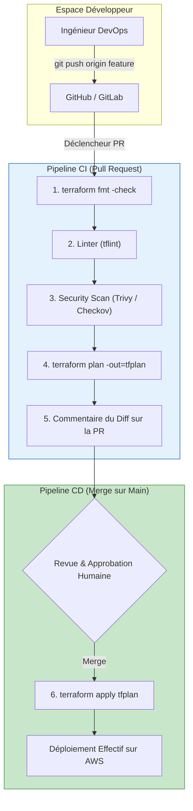
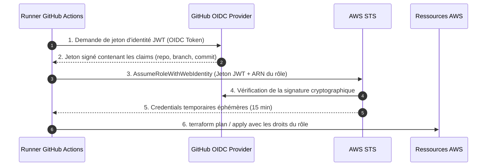

# 09 - Automatisation (Terraform via CI/CD)

En environnement d'entreprise, exécuter `terraform apply` depuis son ordinateur portable est une pratique strictement interdite : cela pose des problèmes majeurs de sécurité (clés d'accès en local), de traçabilité et de risques d'écrasement. Toute modification de l'infrastructure doit obligatoirement passer par un pipeline d'Intégration et de Déploiement Continus (**CI/CD**).

---

## 1. Le Workflow IaC en Entreprise

Le pipeline d'automatisation d'infrastructure sépare le cycle en deux phases distinctes :

1. **Phase de Pull Request (Validation) :** Exécutée à chaque commit sur une branche de feature. Elle teste le code et affiche ce qui va changer sans rien modifier sur AWS.
2. **Phase de Merge sur `main` (Déploiement) :** Exécutée une fois la PR approuvée par les pairs. Elle applique les changements avec verrouillage d'état.



---

## 2. Authentification Zéro-Secret AWS : OIDC (OpenID Connect)

Traditionnellement, les équipes stockaient des identifiants statiques (`AWS_ACCESS_KEY_ID` et `AWS_SECRET_ACCESS_KEY`) dans les "Secrets" du dépôt GitHub. **Cette méthode est aujourd'hui considérée comme une mauvaise pratique de sécurité** (risque de fuite, pas de rotation automatique).

Le standard moderne est **AWS OIDC avec GitHub Actions** :

1. Le runner GitHub Actions demande un jeton cryptographique JWT signé à GitHub.
2. Le runner présente ce jeton au service **AWS STS** via l'API `AssumeRoleWithWebIdentity`.
3. AWS vérifie la signature de GitHub et la branche du dépôt (`repo:mon-org/mon-repo:ref:refs/heads/main`).
4. STS renvoie un jeton temporaire valable 15 minutes. **Zéro clé statique stockée.**



### Configuration Terraform HCL du Rôle OIDC sur AWS

```hcl
# 1. Déclaration de l'Identity Provider GitHub dans AWS IAM
resource "aws_iam_openid_connect_provider" "github" {
  url             = "https://token.actions.githubusercontent.com"
  client_id_list  = ["sts.amazonaws.com"]
  thumbprint_list = ["6938fd4d98bab03faadb97b34396831e3780aea1"]
}

# 2. Trust Policy restreinte à votre organisation et dépôt GitHub précis
data "aws_iam_policy_document" "github_actions_assume_role" {
  statement {
    actions = ["sts:AssumeRoleWithWebIdentity"]
    effect  = "Allow"

    principals {
      type        = "Federated"
      identifiers = [aws_iam_openid_connect_provider.github.arn]
    }

    condition {
      test     = "StringEquals"
      variable = "token.actions.githubusercontent.com:aud"
      values   = ["sts.amazonaws.com"]
    }

    condition {
      test     = "StringLike"
      variable = "token.actions.githubusercontent.com:sub"
      # Restreint strictement au dépôt de votre organisation
      values   = ["repo:mon-organisation/infrastructure-live:*"]
    }
  }
}

# 3. Création du Rôle IAM utilisé par les pipelines CI/CD
resource "aws_iam_role" "github_actions_role" {
  name               = "github-actions-terraform-deployment-role"
  assume_role_policy = data.aws_iam_policy_document.github_actions_assume_role.json
}
```

---

## 3. Pipeline GitHub Actions Complet de Production

Voici le manifeste de workflow `.github/workflows/terraform.yml` intégrant vérification de formatage, scan de sécurité statique (**Checkov**), plan spéculatif et apply automatique :

```yaml
name: "Terraform Production Pipeline"

on:
  push:
    branches:
      - main
  pull_request:
    branches:
      - main

# Droits nécessaires pour l'échange de jeton OIDC
permissions:
  id-token: write
  contents: read
  pull-requests: write

jobs:
  validate_and_plan:
    name: "Terraform Lint, Security & Plan"
    runs-on: ubuntu-latest
    steps:
      - name: Checkout Code
        uses: actions/checkout@v4

      - name: Authentification AWS via OIDC
        uses: aws-actions/configure-aws-credentials@v4
        with:
          role-to-assume: arn:aws:iam::123456789012:role/github-actions-terraform-deployment-role
          aws-region: eu-west-3

      - name: Setup Terraform
        uses: hashicorp/setup-terraform@v3
        with:
          terraform_version: 1.8.0

      - name: 1. Format Check
        run: terraform fmt -check -diff

      - name: 2. Terraform Init
        run: terraform init

      - name: 3. Terraform Validate
        run: terraform validate

      - name: 4. Security Scan avec Checkov (DevSecOps)
        uses: bridgecrewio/checkov-action@master
        with:
          framework: terraform
          soft_fail: false # Bloque le pipeline si une faille critique est détectée

      - name: 5. Terraform Plan
        id: plan
        run: |
          terraform plan -no-color -out=tfplan
        continue-on-error: false

      - name: Publier le Résultat du Plan sur la Pull Request
        uses: actions/github-script@v7
        if: github.event_name == 'pull_request'
        with:
          script: |
            const output = `#### Terraform Format & Style: ✅ Success
            #### Terraform Validation: ✅ Success
            #### Checkov Security Scan: ✅ Passed
            #### Terraform Plan: ✅ Generated`;
            github.rest.issues.createComment({
              issue_number: context.issue.number,
              owner: context.repo.owner,
              repo: context.repo.repo,
              body: output
            })

  apply:
    name: "Terraform Apply (Production)"
    needs: validate_and_plan
    if: github.ref == 'refs/heads/main' && github.event_name == 'push'
    runs-on: ubuntu-latest
    environment: production # Nécessite une approbation humaine dans les settings GitHub
    steps:
      - name: Checkout Code
        uses: actions/checkout@v4

      - name: Authentification AWS via OIDC
        uses: aws-actions/configure-aws-credentials@v4
        with:
          role-to-assume: arn:aws:iam::123456789012:role/github-actions-terraform-deployment-role
          aws-region: eu-west-3

      - name: Setup Terraform
        uses: hashicorp/setup-terraform@v3
        with:
          terraform_version: 1.8.0

      - name: Terraform Init
        run: terraform init

      - name: Terraform Apply
        run: terraform apply -auto-approve
```

---

## 4. Multi-Environnements : Dossiers vs Workspaces

En entretien, le débat **"Terraform Workspaces vs Directory Isolation"** est incontournable :

| Critère | Terraform Workspaces | Dossiers Dédiés (`environments/dev`, `prod`) |
|---|---|---|
| **Principe** | Un seul code HCL, l'état bascule via `terraform workspace select prod`. | Des dossiers physiques distincts avec leurs propres fichiers `main.tf` appelant des modules. |
| **Backend State** | Même bucket S3, préfixé par workspace. | **Buckets S3 ou clés totalement séparés.** |
| **Isolation des Comptes AWS** | Complexe (nécessite des logiques dynamiques de providers). | **Excellente :** Dev tourne sur le compte AWS 111111, Prod sur le compte 999999. |
| **Rayon d'impact (Blast Radius)** | Risque élevé d'erreur humaine (oublier de changer de workspace). | Confinement strict des droits et des accès IAM. |
| **Verdict d'Entreprise** | Bon pour des environnements éphémères de test. | **Le standard recommandé en production.** |

---

## 5. Détection de Dérive (Drift Detection)

Que se passe-t-il si un administrateur modifie une règle de pare-feu directement sur la console AWS sans passer par Git ?
Pour éviter l'accumulation d'écarts invisibles, les équipes DevOps mettent en place un **Cron de Détection de Dérive** quotidien (la nuit) :

```bash
# Dans le pipeline cron de nuit :
terraform plan -detailed-exitcode -no-color
```

* Si le code de sortie est **`2`** : Une dérive a été détectée ! Le pipeline envoie une notification sur Slack ou ouvre automatiquement un ticket d'incident dans Jira pour réconciliation.

---

## 6. Terraform (Push) vs ArgoCD (Pull) : La Nuance Indispensable

Une question classique en entretien DevOps / GitOps : *"Si vous utilisez ArgoCD, avez-vous encore besoin de Terraform ?"*

* **Terraform (Push Model) :** Déploie **l'infrastructure sous-jacente** (le matériel virtuel) : VPC, Internet Gateway, RDS, buckets S3, et le cluster EKS lui-même.
* **ArgoCD (Pull Model / GitOps) :** S'exécute **à l'intérieur du cluster EKS** créé par Terraform. Il surveille les dépôts applicatifs et synchronise en continu les déploiements de conteneurs, services K8s et ingress HTTP.

---

## 7. Questions d'Entretien Fréquentes (Niveau Entry-Level)

!!! question "Q: Pourquoi l'authentification OIDC est-elle infiniment supérieure aux Access Keys statiques en CI/CD ?"
    L'authentification OIDC élimine totalement le besoin de stocker des identifiants secrets AWS longue durée dans les paramètres de la CI/CD (GitHub Secrets). Les jetons délivrés par AWS STS sont éphémères (15 minutes), signés cryptographiquement et strictement conditionnés sur le dépôt Git et la branche d'exécution. Même si le pipeline est compromis, aucun mot de passe permanent n'est exposé.

!!! question "Q: Pourquoi privilégie-t-on la séparation par répertoires plutôt que les Workspaces Terraform pour isoler le Dev et la Prod ?"
    Les Workspaces partagent par défaut la même configuration de backend et le même compte AWS, ce qui augmente le risque qu'une commande exécutée par erreur dans le mauvais workspace écrase la production. La séparation physique par dossiers (`environments/dev` et `environments/prod`) permet d'isoler hermétiquement les comptes AWS (comptes dédiés), les clés KMS de chiffrement et d'attribuer des permissions IAM distinctes aux ingénieurs selon l'environnement.

!!! question "Q: Comment configurez-vous un pipeline pour détecter automatiquement les dérives manuelles (Drift) sur AWS ?"
    On programme un pipeline CI/CD récurrent (cron nocturne) qui exécute `terraform plan -detailed-exitcode`. Si le script renvoie le code de sortie `2`, cela signifie que des ressources ont été modifiées ou supprimées hors de Terraform (ex: modification manuelle dans la console AWS). Le pipeline alerte alors immédiatement l'équipe par Slack ou webhook afin qu'elle puisse réintégrer la modification dans le code ou lancer un `apply` pour écraser la dérive.