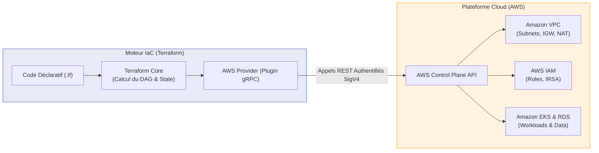

# Terraform & AWS — Overview

!!! info "Goal of this section"
    Complete preparation for the **DevOps / Cloud Platform Engineer (Entry-Level / Junior)** role, focused on the requirements of large software vendors and Cloud R&D environments (such as Oracle Cloud, AWS, and enterprise accounts). This section deeply merges the internal mechanisms of **Terraform** (declarative IaC, State, DAG, HCL) and the **AWS** ecosystem (VPC networking, least-privilege IAM, EKS, RDS, S3, OIDC).

---

## 1. The Synergy: Terraform + AWS

In a modern engineering team, infrastructure is never configured manually through the AWS console (a practice known as *"ClickOps"*, banned in production because it is untraceable, error-prone, and irreproducible).

Terraform and AWS form the industry-standard pair:

* **Terraform** provides the universal execution engine: declarative HCL syntax, state reconciliation (`State`), dependency graph computation (DAG), and automation via CI/CD.
* **AWS** provides the target infrastructure: isolated virtual network (VPC), managed compute (EKS, EC2), persistence (RDS, S3), and fine-grained security (IAM, STS).

---

## 2. Curriculum & Interview Priority Matrix

Each chapter is designed to cover the theoretical architecture, concrete production HCL code, and tricky questions asked by technical interviewers.

| Module | Key Topics | Terraform + AWS Synergy | Interview Priority |
|---|---|---|:---:|
| **01. IaC & HCL Fundamentals** | Declarative vs Imperative, Terraform Core, DAG, OpenTofu | AWS provider configuration, credentials, `terraform {}` block | 🟢 Basic |
| **02. Commands & Lifecycle** | `init/plan/apply/destroy` workflow, Day-2 operations (`state mv`, `import`, `replace`) | Impact of operations on AWS APIs, exit codes in CI/CD | 🔴 Critical |
| **03. State & Remote Backend** | `terraform.tfstate`, concurrency, locking, corruption | **S3** (KMS encryption, versioning) + **DynamoDB** (`LockID` lock) | 🔴 Critical |
| **04. Variables, Locals & Outputs** | Strict typing, validation, `sensitive` block, precedence order | Masking AWS secrets (RDS passwords), standardized tagging | 🟡 Intermediate |
| **05. Reusable Modules** | DRY, Root vs Child, Registry, semantic Git versioning | Encapsulation of complex AWS resources (VPC, EKS, Bastion) | 🔴 Critical |
| **06. AWS Networking via IaC** | Multi-AZ VPC architecture, public/private subnets, NAT, SG vs NACL | Complete AWS network authoring in HCL, `cidrsubnet()`, endpoints | 🔴 Critical |
| **07. AWS IAM & Security** | Least privilege, Roles vs Users, Trust Policies | Policies via `data.aws_iam_policy_document`, **IRSA** for EKS | 🔴 Critical |
| **08. Cloud Provisioning** | EKS (managed Kubernetes), EC2 ASG, RDS PostgreSQL, secure S3 | Full Compute + Data interconnection in private subnets | 🔴 Critical |
| **09. CI/CD Automation** | GitHub Actions pipeline, PR validation, cron drift detection | Secretless authentication via **AWS OIDC / AssumeRole** | 🔴 Critical |
| **10. R&D Interview Cheatsheet** | Decision matrices, emergency CLI, incident resolution | Top 15 tricky questions and real-world failure scenarios | 🔴 Critical |

---

## 3. Interview Revision Methodology

To ace your DevOps engineer interview:

1. **Master the architecture diagrams:** You must be able to reproduce on a whiteboard the Multi-AZ VPC diagram (Module 06), the DynamoDB State locking mechanism (Module 03), and the passwordless OIDC authentication flow (Modules 07 & 09).
2. **Do not confuse IaC and Configuration Management:** Terraform provisions infrastructure (servers, networks, clusters). Tools like Ansible or cloud-init scripts configure the inside of the operating system once it is running.
3. **Always think security and Day-2 Operations:** In interviews, questions are not just about *"how to create an EC2"*, but about *"how to rename a resource without destroying it"*, *"how to store state without leaking secrets"* or *"how to react to a stuck Lock"*.
4. **Test your knowledge:** Each chapter ends with a section of real interview questions. Try to formulate your answer out loud before reading the solution.
