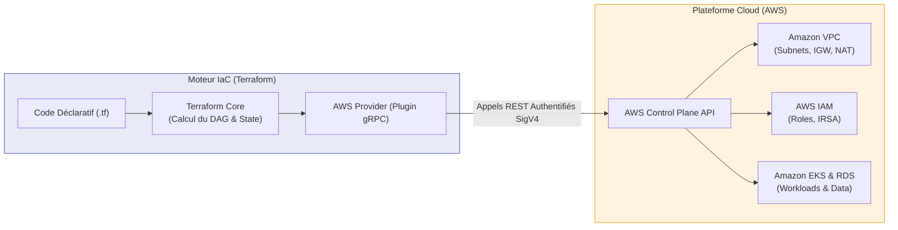

# Terraform & AWS — Vue d'ensemble

!!! info "Objectif de cette section"
    Préparation complète au rôle de **DevOps / Cloud Platform Engineer (Entry-Level / Junior)**, avec un focus sur les exigences des grands éditeurs et environnements Cloud R&D (comme Oracle Cloud, AWS, grands comptes). Cette section fusionne en profondeur les mécanismes internes de **Terraform** (IaC déclaratif, State, DAG, HCL) et l'écosystème **AWS** (Networking VPC, IAM de moindre privilège, EKS, RDS, S3, OIDC).

---

## 1. La Synergie : Terraform + AWS

Dans une équipe d'ingénierie moderne, l'infrastructure n'est jamais configurée manuellement via la console AWS (pratique dite *"ClickOps"*, bannie en production car non traçable, sujette aux erreurs humaines et non reproductible).

Terraform et AWS forment le binôme standard de l'industrie :

* **Terraform** apporte le moteur d'exécution universel : syntaxe déclarative HCL, réconciliation d'état (`State`), calcul du graphe de dépendances (DAG) et automatisation via CI/CD.
* **AWS** apporte l'infrastructure cible : réseau virtuel étanche (VPC), calcul managé (EKS, EC2), persistance (RDS, S3) et sécurité granulaire (IAM, STS).

---

## 2. Programme & Matrice de Priorité Entretien

Chaque chapitre a été conçu pour couvrir à la fois l'architecture théorique, le code HCL concret de production et les questions pièges posées par les recruteurs techniques.

| Module | Thématiques Clés | Synergie Terraform + AWS | Priorité Entretien |
|---|---|---|:---:|
| **01. Fondamentaux IaC & HCL** | Déclaratif vs Impératif, Terraform Core, DAG, OpenTofu | Configuration du provider AWS, credentials, bloc `terraform {}` | 🟢 Basique |
| **02. Commandes & Cycle de vie** | Workflow `init/plan/apply/destroy`, Day-2 operations (`state mv`, `import`, `replace`) | Impact des opérations sur les API AWS, exit codes en CI/CD | 🔴 Critique |
| **03. State & Remote Backend** | `terraform.tfstate`, concurrence, locking, corruption | **S3** (chiffrement KMS, versioning) + **DynamoDB** (verrou `LockID`) | 🔴 Critique |
| **04. Variables, Locals & Outputs** | Typage strict, validation, bloc `sensitive`, ordre de précédence | Masquage des secrets AWS (RDS passwords), tagging standardisé | 🟡 Intermédiaire |
| **05. Modules Réutilisables** | DRY, Root vs Child, Registry, versioning Git sémantique | Encapsulation de ressources AWS complexes (VPC, EKS, Bastion) | 🔴 Critique |
| **06. AWS Networking via IaC** | Architecture VPC Multi-AZ, Subnets publics/privés, NAT, SG vs NACL | Écriture complète du réseau AWS en HCL, `cidrsubnet()`, endpoints | 🔴 Critique |
| **07. AWS IAM & Sécurité** | Principe du moindre privilège, Roles vs Users, Trust Policies | Policies via `data.aws_iam_policy_document`, **IRSA** pour EKS | 🔴 Critique |
| **08. Provisionnement Cloud** | EKS (Kubernetes managé), EC2 ASG, RDS PostgreSQL, S3 sécurisé | Interconnexion complète Compute + Data dans les subnets privés | 🔴 Critique |
| **09. Automatisation CI/CD** | Pipeline GitHub Actions, PR validation, drift detection cron | Authentification sans secret via **AWS OIDC / AssumeRole** | 🔴 Critique |
| **10. Cheatsheet Entretien R&D** | Matrices de décision, CLI de secours, résolution d'incidents | Top 15 des questions pièges et scénarios de panne vécus | 🔴 Critique |

---

## 3. Méthodologie de Révision pour l'Entretien

Pour réussir votre entretien d'ingénieur DevOps :

1. **Maîtrisez les schémas d'architecture :** Vous devez être capable de reproduire au tableau blanc le schéma du VPC Multi-AZ (Module 06), le mécanisme de verrouillage du State avec DynamoDB (Module 03), et le flux d'authentification OIDC sans mot de passe (Module 07 & 09).
2. **Ne confondez pas IaC et Configuration Management :** Terraform provisionne l'infrastructure (serveurs, réseaux, clusters). Des outils comme Ansible ou les scripts cloud-init configurent l'intérieur du système d'exploitation une fois démarré.
3. **Pensez toujours sécurité et Day-2 Operations :** En entretien, les questions ne portent pas seulement sur *"comment créer une EC2"*, mais sur *"comment renommer une ressource sans la détruire"*, *"comment stocker le state sans fuite de secrets"* ou *"comment réagir face à un Lock bloqué"*.
4. **Testez vos connaissances :** Chaque chapitre se termine par une section de questions d'entretien réelles. Essayez de formuler votre réponse à voix haute avant de lire la correction.
